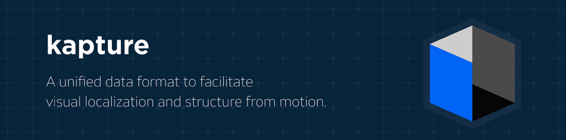

:sectnums:
:sectnumlevels: 1
:toc: macro
:toclevels: 2

toc::[]

image::https://github.com/naver/kapture/workflows/kapture-main/badge.svg[Continuous Integration Status]

== Overview

Kapture is a pivot file format, based on text and binary files, used to describe SfM (Structure From Motion) and more generally sensor-acquired data.

It can be used to store sensor parameters and raw sensor data:

- cameras
- images
- lidar and other sensor data

As well as computed data:

- 2d features
- 3d reconstruction

Finally, many popular datasets can directly be downloaded using the convenient https://github.com/naver/kapture/blob/main/doc/tutorial.adoc#download-a-dataset[downloader]!

== Specifications
The format specification is detailed in the link:kapture_format.adoc[kapture format specifications document].

== Example File Structure

This is an example file structure of a dataset in the kapture format.

[source,txt]
----
my_dataset                 # Dataset root path
├─ sensors/                # Sensor data root path
│  ├─ sensors.txt          # list of all sensors with their specifications (e.g. camera intrinsics)
│  ├─ rigs.txt             # geometric relationship between sensors (optional)
│  ├─ trajectories.txt     # extrinsics (timestamp, sensor, pose)
│  ├─ records_camera.txt   # all records of type 'camera' (timestamp, sensor and path to image)
│  ├─ records_SENSOR_TYPE.txt # all records of type SENSOR_TYPE (other sensors, eg: 'magnetic', 'pressure'...)
│  └─ records_data/            # image and lidar data path
│     ├─ map/cam_01/00001.jpg  # image path used in records_camera.txt (example)
│     ├─ map/cam_01/00002.jpg
│     ├─ map/lidar_01/0001.pcd # lidar data path used in records_lidar.txt
│     ├─ query/query001.jpg    # image path used in records_camera.txt
│     ├─ ...
└─ reconstruction/
   ├─ keypoints/                       # 2D keypoints files
   │  ├─ r2d2_WASF-N8_20k              # identify the type of keypoints
   │  │  ├─ keypoints.txt              # type of keypoint (shape and dtype)
   │  │  ├─ map/cam_01/00001.jpg.kpt   # keypoints for corresponding image (example)
   │  │  ├─ query/query001.jpg.kpt     # keypoints for corresponding image (example)
   │  │  ├─ ...
   │  ├─ d2_tf                         # identify the type of keypoints
   │  │  ├─ keypoints.txt              # type of keypoint (shape and dtype)
   │  │  ├─ keypoints.tar              # instead of regular files, you can use an archive
   │  │  │  ├─ map/cam_01/00001.jpg.kpt   # keypoints for corresponding image (example)
   │  │  │  ├─ query/query001.jpg.kpt     # keypoints for corresponding image (example)
   │  │  │  ├─ ...
   │  ├─ ...
   ├─ descriptors/                     # keypoint descriptors files
   │  ├─ r2d2_WASF-N8_20k              # identify the type of descriptors
   │  │  ├─ descriptors.txt            # type of descriptor (keypoints type, shape and dtype)
   │  │  ├─ map/cam_01/00001.jpg.desc  # descriptors for corresponding image (example)
   │  │  ├─ query/query001.jpg.desc    # descriptors for corresponding image (example)
   │  │  ├─ ...
   │  ├─ d2_tf                         # identify the type of descriptors
   │  │  ├─ descriptors.txt            # type of descriptor
   │  │  ├─ descriptors.tar            # instead of regular files, you can use an archive
   │  │  │  ├─ map/cam_01/00001.jpg.desc  # descriptors for corresponding image (example)
   │  │  │  ├─ query/query001.jpg.desc    # descriptors for corresponding image (example)
   │  │  │  ├─ ...
   │  ├─ ...
   ├─ points3d.txt                  # 3D points of the reconstruction
   ├─ observations.txt              # 2D/3D points corespondences
   ├─ matches/                      # matches files.
   │  ├─ r2d2_WASF-N8_20k           # identify the type of keypoints that are matched
   │  │  ├─ map/cam_01/00001.jpg.overlapping/cam_01/00002.jpg.matches # example
   │  │  ├─  ...
   │  ├─ d2_tf                      # identify the type of keypoints that are matched
   │  │  ├─ matches.tar             # instead of regular files, you can use an archive
   │  │  │  ├─ map/cam_01/00001.jpg.overlapping/cam_01/00002.jpg.matches # example
   │  │  │  ├─  ...
   │  ├─ ...
   └─ global_features/                 # global feature files
      ├─ AP-GeM-LM18                   # identify the type of global_features
      │  ├─ global_features.txt        # type of global feature
      │  ├─ map/cam_01/00001.jpg.gfeat # example of global feature for corresponding image
      │  ├─ query/query001.jpg.gfeat   # example of global feature for corresponding image
      │  └─ ...
      ├─ DELG                          # identify the type of global_features
      │  ├─ global_features.txt        # type of global feature
      │  ├─ global_features.tar        # instead of regular files, you can use an archive
      │  │  ├─ map/cam_01/00001.jpg.gfeat # example of global feature for corresponding image
      │  │  ├─ query/query001.jpg.gfeat   # example of global feature for corresponding image
      │  │  └─ ...
      ├─ ...
----

== Software

The kapture format is provided with a Python library, as well as several conversion tools.

=== Install

[source,bash]
pip install kapture

or see link:doc/installation.adoc[installation] for more detailed instructions.

=== Using docker

Build the docker image:

[source,bash]
----
# build the docker image : if you have already cloned the repository
docker build . -t kapture/kapture
# OR build the docker image directly from github
docker build git://github.com/naver/kapture -t kapture/kapture
# run unit tests
docker run -it --rm kapture/kapture python3 -m unittest discover -s /opt/src/kapture/tests
----

If you want to process your own data, you can bind directories between the host and the container using
`--volume` or `--mount` option (See the https://docs.docker.com/storage/bind-mounts/[docker documentation]).
The following example mounts `/path/to/dataset/` from the host to `/dataset` inside the docker.

[source,bash]
----
docker run -it \
    --rm \ # Automatically remove the container when it exits \
    --volume /path/to/dataset/:/dataset:ro \ #read only
    kapture/kapture
----

=== kapture Python library

See the https://github.com/naver/kapture/blob/main/doc/tutorial.adoc#using-kapture-in-your-code[tutorial]
for some examples using the kapture Python library.

=== kapture tools

In this repository, you will find a set of *conversion tools* to or from kapture format.
Import results to kapture format, and conversely, export converts kapture data to other formats.
Depending of the format, some data might not be converted, either because the other format does not support it (`—`)
or because its was not implemented (`⨉`). Here is a table summarizing the conversion capabilities:

.conversion capabilities
|===
| Format                    | <- ->  | cam  | rig  | img  | trj  | gps  | kpt  | dsc  | gft  | p3D  | obs  | mch

.2+| colmap                 | import |  ✓   |  ✓   |  ✓   |  ✓   |  ⨉   |  ✓   |  ✓   |  —   |  ✓   |  ✓   | (✓)
                            | export |  ✓   |  ✓   |  ✓   |  ✓   |  ⨉   |  ✓   |  ✓   |  —   |  ✓   |  ✓   | (✓)
.2+| openmvg                | import |  ✓   |  —   |  ✓   |  ✓   |  ⨉   |  ✓   |  ✓   |  —   |  ✓   |  ✓   |  (✓) 
                            | export |  ✓   |  —   |  ✓   |  ✓   |  ⨉   |  (✓)   |  (✓)   |  —   |  ✓   |  ✓   |  (✓) 
.2+| OpenSfM                | import |  ✓   |  ⨉   |  ✓   |  ✓   |  ✓   |  ✓   |  ✓   |  —   |  ✓   |  ⨉   |  ✓
                            | export |  ✓   |  ⨉   |  ✓   |  ✓   |  ⨉   |  ✓   |  —   |  ✓   |  —   |  ⨉   |  ✓
| bundler                   | import |  ✓   |  —   |  ✓   |  ✓   |  —   |  ✓   |  —   |  —   |  ✓   |  ✓   |  — 
| image_folder              | import |  —   |  —   |  ✓   |  —   |  —   |  —   |  —   |  —   |  —   |  —   |  — 
| image_list                | import |  ✓   |  —   |  ✓   |  —   |  —   |  —   |  —   |  —   |  —   |  —   |  — 
| nvm                       | import |  ✓   |  —   |  ✓   |  ✓   |  —   |  ✓   |  —   |  —   |  ✓   |  ✓   |  — 
| IDL_dataset_cvpr17        | import |  ✓   |  —   |  ✓   |  ✓   |  —   |  —   |  —   |  —   |  —   |  —   |  — 
| RobotCar_Seasons          | import |  ✓   |  ✓   |  ✓   |  ✓   |  —   |  ✓   |  —   |  —   |  ✓   |  ✓   |  —
| ROSbag cameras+trajectory | import | (✓)  | (✓)  |  ✓   |  ✓   |  ⨉   |  —   |  —   |  —   |  —   |  —   |  — 
| SILDa                     | import |  ✓   |  ✓   |  ✓   |  ✓   |  —   |  —   |  —   |  —   |  —   |  —   |  —
| virtual_gallery           | import |  ✓   |  ✓   |  ✓   |  ✓   |  —   |  —   |  —   |  —   |  —   |  —   |  —
| stereolabs zed2           | import |  ✓   |  ✓   |  ✓   |  ✓   |  —   |  —   |  —   |  —   |  —   |  —   |  —
|===

:Notes:
 - `✓`: supported, `(✓)` partially supported, `⨉`: not implemented, `—`: not supported by format.
 - `cam`: handle camera parameters, eg. intrisics
 - `rig`: handle rig structure.
 - `img`: handle the path to images.
 - `trj`: handle trajectories, eg. poses.
 - `kpt`: handle image keypoints locations.
 - `dsc`: handle image keypoints descriptors.
 - `gft`: handle global image feature descriptors.
 - `p3D`: handle 3D point clouds.
 - `obs`: handle observations, ie. 3D-points / 2D keypoints correspondences.
 - `mch`: handle keypoints matches.

link:https://gist.github.com/jo-chemla/258e6e40d3d6c2220b29518ff3c17c40[Here], you can also find an utility tool for
cropping input images of a kapture dataset. Thanks Jonathan Chemla for the contribution.

== kapture support in other packages

=== Local Features
- https://arxiv.org/abs/1906.06195[R2D2] local features can be directly generated in kapture format. See https://github.com/naver/r2d2#feature-extraction-with-kapture-datasets[here]
- https://arxiv.org/abs/1905.03561[D2-Net] features can also be extracted in kapture format. See instructions https://github.com/mihaidusmanu/d2-net#feature-extraction-with-kapture-datasets[here].

=== Global Features
- https://europe.naverlabs.com/research/computer-vision-research-naver-labs-europe/learning-visual-representations/deep-image-retrieval/[AP-GeM] global feature extractor in kapture format: https://github.com/naver/deep-image-retrieval#feature-extraction-with-kapture-datasets[here]

== Datasets

The kapture package provides conversion tools for several data formats and datasets used in the domain.
But it also provides a tool to download datasets already converted to kapture.
See the link:doc/tutorial.adoc[kapture tutorial] for instructions to use the dataset downloader.

Here is a list of datasets you can directly download in kapture format with the downloader tool:

* Datasets for the https://www.visuallocalization.net/datasets/[Long Term Visual Localization] benchmark:
** https://europe.naverlabs.com/blog/first-of-a-kind-large-scale-localization-datasets-in-crowded-indoor-spaces/[NAVER LABS localization datasets]
** Aachen Day Night v1.1
** Extended CMU-Seasons
** RobotCar Seasons v2
** InLoc (without images)
** SILDa Weather and Time of Day
** RIO10
** ETH-Microsoft
* https://europe.naverlabs.com/research/3d-vision/virtual-gallery-dataset/[Virtual Gallery] dataset

== kapture-localization

Checkout https://github.com/naver/kapture-localization[kapture-localization], our toolbox which contains implementations for various localization related algorithms. 

 - mapping and localization pipelines with custom features
 - mapping and localization pipelines with SIFT and vocabulary tree matching (default colmap pipeline)
 - image retrieval benchmark (global sfm, local sfm, pose approximation)

== Tutorial

See the link:doc/tutorial.adoc[kapture tutorial] for a short introduction to:

 - conversion tools
 - using kapture in your code
 - dataset download

== Contributing

There are many ways to contribute to the kapture project:

* provide feedback and suggestions of improvements
* submit bug reports in the project bug tracker
* provide a dataset in kapture format that we can add to the downloader tool
* implement a feature or bug-fix for an outstanding issue
* add support of kapture format in other software packages (e.g. SfM pipelines...), thus adding support for more datasets
* provide scripts to create data in kapture format (e.g. local/global feature extraction)
* propose a new feature and implement it

If you wish to contribute, please refer to the  link:CONTRIBUTING.adoc[CONTRIBUTING] page.

== License
Software license is detailed in the link:LICENSE[LICENSE] file.

== Contact Us
You can contact us through https://github.com/naver/kapture[GitHub], or at kapture at naverlabs + com
