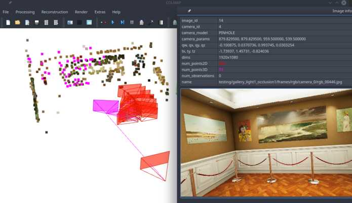

= kapture / quick start
:sectnums:
:sectnumlevels: 1
:toc:
:toclevels: 2

== Install
[source,bash]
pip install kapture

NOTE: For this tutorial, you also must have __colmap__ version >=3.6.
On ubuntu 18.04, __apt__ will install __colmap__ 3.4.
In this case, you will have to compile __colmap__ from source instead.

Or you can use the ready-to-use docker image:
[source,bash]
----
docker build . -t kapture/kapture
docker run --runtime=nvidia -it --rm  --volume /path/to/dataset/:/dataset kapture/kapture     # <1>
----
(1) replace `/path/to/dataset/` with the path where you (will) store datasets on the host.

See link:installation.adoc[installation] for detailed instructions.

== Download a dataset

[source,bash]
----
cd /path/to/dataset
# update the list from repositories
kapture_download_dataset.py update
# display the list dataset
kapture_download_dataset.py list
# install mapping and query of Extended-CMU-Seasons_slice22
kapture_download_dataset.py install "RobotCar_Seasons-v2_49_*"      # <1>
----

<1> uses double quotes (`"`) to make sure the wildcard (`*`) is not interpreted by bash.

== Convert a dataset to kapture

While we provide many datasets in __kapture__ format, you may want to convert datasets you already downloaded.

See https://github.com/naver/kapture/blob/master/doc/datasets.adoc for more details.

== Using kapture in your code

__kapture__ is also a python library, that you can use in your code.

=== Import package

To be able to `import kapture`, you should either :

 - install the kapture package (see <<install>>) or
 - add __kapture__  to the python path (eg. see below).

[source,python]
----
import sys
REPO_ROOT_PATH = '../..'  # change with the path to path to root directory
sys.path.insert(0, REPO_ROOT_PATH)
import kapture
----

=== Load a dataset

In this example, we will print out the positions of the devices stored in `trajectories.txt`.

First, load a dataset:

[source,python]
----
import kapture.io.csv as csv

kapture_data = csv.kapture_from_dir('../samples/virtual_gallery/kapture/training')
----

=== Get poses

Then, loop over the stored positions, and print them:

[source,python]
----
# loop over the nested trajectories [timestamp][device_id] = pose -> position
for timestamps, poses in kapture_data.trajectories.items():
    print(f'timestamp: {timestamps:05d}')
    for sensor_id, pose in poses.items():
        print(f' └─ [{sensor_id}] = {pose.inverse().t.flatten()}')
----

NOTE: In trajectories, `pose` are transforms from world to device.
To obtain the position of the device (from device to world) you need to inverse the pose.

outputs :

[source,bash]
----
timestamp: 00000
 └─ [training_camera_0] = [-2.00292055 -1.65       -2.53706475]
 └─ [training_camera_1] = [-1.9039761  -1.65       -2.55155863]
 └─ [training_camera_2] = [-1.86705559 -1.65       -2.64449356]
 └─ [training_camera_3] = [-1.92907956 -1.65       -2.72293503]
 └─ [training_camera_4] = [-2.02802352 -1.65       -2.70844152]
 └─ [training_camera_5] = [-2.06494409 -1.65       -2.61550737]
timestamp: 00001
 └─ [training_camera_0] = [-2.06899583 -1.65       -2.3578293 ]
 └─ [training_camera_1] = [-1.97085445 -1.65       -2.37702379]
...
----

More simply, you can flatten the nested timestamps / device_id:

[source,python]
----
for timestamp, sensor_id, pose in kapture.flatten(kapture_data.trajectories, is_sorted=True):
    print(f'[{timestamp:05d}, {sensor_id}] = {pose.inverse().t.flatten()}')
----

outputs:

[source,bash]
----
[00000, training_camera_0] = [-2.00292055 -1.65       -2.53706475]
[00000, training_camera_1] = [-1.9039761  -1.65       -2.55155863]
[00000, training_camera_2] = [-1.86705559 -1.65       -2.64449356]
[00000, training_camera_3] = [-1.92907956 -1.65       -2.72293503]
[00000, training_camera_4] = [-2.02802352 -1.65       -2.70844152]
[00000, training_camera_5] = [-2.06494409 -1.65       -2.61550737]
[00001, training_camera_0] = [-2.06899583 -1.65       -2.3578293 ]
[00001, training_camera_1] = [-1.97085445 -1.65       -2.37702379]
...
----

=== Reconstruction

Let's have a look at the reconstruction. First, import more tools from kapture and load another sample dataset:

[source,python]
----
# imports some additional tools
from kapture.io.features import keypoints_to_filepaths, image_keypoints_from_file
from kapture.io.records import images_to_filepaths
from kapture.io.image import image_keypoints_to_image_file
from PIL import Image
from tqdm import tqdm
# load another dataset with reconstruction
kapture_data = csv.kapture_from_dir('../samples/maupertuis/kapture/')
----

Let's see what is stored in __keypoints__, __descriptors__ and __matches__:
[source,python]
----
print(f'keypoints       :  {kapture_data.keypoints}')
print(f'descriptors     :  {kapture_data.descriptors}')
print(f'global_features :  {kapture_data.global_features}')
print(f'matches         :  {kapture_data.matches}')
print(f'observations    :\n{kapture_data.observations}')
print(f'points3d        :\n{kapture_data.points3d}')
----

output:

[source,bash]
----
keypoints       :  SIFT (float32 x 6) = [
	00.jpg,
	02.jpg,
	01.jpg,
	03.jpg
]
descriptors     :  SIFT (uint8 x 128) = [
	00.jpg,
	02.jpg,
	01.jpg,
	03.jpg
]
global_features :  None
matches         :  [
	(01.jpg , 02.jpg),
	(01.jpg , 03.jpg),
	(00.jpg , 03.jpg),
	(00.jpg , 02.jpg),
	(02.jpg , 03.jpg),
	(00.jpg , 01.jpg)
]
observations    :
[00000]: 	(01.jpg, 4561)	(02.jpg, 3389)	(00.jpg, 4975)	(03.jpg, 3472)
[00001]: 	(01.jpg, 4557)	(02.jpg, 4128)	(00.jpg, 4970)
[00002]: 	(01.jpg, 4554)	(02.jpg, 3466)	(00.jpg, 4958)	(03.jpg, 3556)
....
[01036]: 	(01.jpg, 2484)	(02.jpg, 3702)	(00.jpg, 2527)	(03.jpg, 3944)
[01037]: 	(01.jpg, 2498)	(02.jpg, 2191)	(00.jpg, 2621)
[01038]: 	(01.jpg, 2507)	(02.jpg, 1941)	(00.jpg, 2696)

points3d        :
[[ -2.39675   4.62278  13.2759   57.       57.       49.     ]
 [ -2.34421   4.5307   13.3448   63.       65.       62.     ]
 [ -1.1903    4.56941  13.7496  159.      161.      156.     ]
 ...
 [  1.82224   5.7889   17.4739  163.      165.      159.     ]
 [ -0.41245   5.08333  13.8041  119.      124.      129.     ]
 [ -1.54589   5.02867  13.463   100.       97.       89.     ]]
----

=== Keypoints

Then, we load the keypoints of the first image (`00.jpg`) as a numpy array using `image_keypoints_from_file`:

[source,python]
----
image_name = '00.jpg'
# keypoints_filepaths[image_name] -> keypoints file full path
keypoints_filepaths = keypoints_to_filepaths(kapture_data.keypoints, kapture_dirpath)
# for image_name in kapture_data.keypoints:
keypoints_filepath = keypoints_filepaths[image_name]
keypoints_data = image_keypoints_from_file(filepath=keypoints_filepath,
                                           dsize=kapture_data.keypoints.dsize,
                                           dtype=kapture_data.keypoints.dtype)
print(f'keypoints of "{image_name}" as numpy array of {keypoints_data.dtype} and shape {keypoints_data.shape}:')
print(keypoints_data)
----

output:

[source,bash]
----
keypoints of "00.jpg" as numpy array of float32 and shape (6424, 6):
[[ 1.2909084e+03  4.1563606e+00 -1.3475049e+00  1.4732410e+00
  -1.4732410e+00 -1.3475049e+00]
 [ 6.2747311e+01  4.7568941e+00  1.1128439e-01  1.7677375e+00
  -1.7677375e+00  1.1128439e-01]
 [ 2.1730029e+02  4.4497972e+00  4.6869200e-01  2.0487530e+00
  -2.0487530e+00  4.6869200e-01]
 ...
 [ 3.5506705e+02  7.7944904e+02 -4.8760738e+01  4.1329781e+01
  -4.1329781e+01 -4.8760738e+01]
 [ 1.6452257e+03  6.0981189e+02  5.6920929e+01  5.7031525e+01
  -5.7031525e+01  5.6920929e+01]
 [ 1.3813167e+03  6.6880566e+02  5.9981022e+01  4.6423214e+01
  -4.6423214e+01  5.9981022e+01]]
----

There are similar functions for `descriptors`, `global_features` and `matches`.
For convienence, __kapture__ also provides function the `image_keypoints_to_image_file`,
to directly draw keypoints on top of an image:

[source,python]
----
# images_filepaths[image_name] -> image file full path
images_filepaths = images_to_filepaths(kapture_data.records_camera, kapture_dirpath)
for image_name in tqdm(kapture_data.keypoints):
    image_filepath = images_filepaths[image_name]
    keypoints_filepath = keypoints_filepaths[image_name]
    image_with_kp_filepath = keypoints_filepath + '_preview.jpg'
    with Image.open(image_filepath) as image:
        image_keypoints_to_image_file(
            output_filepath=image_with_kp_filepath,
            image_filepath=image_filepath,
            keypoints_filepath=keypoints_filepath,
            keypoint_dtype=kapture_data.keypoints.dtype,
            keypoint_dsize=kapture_data.keypoints.dsize,
            radius=6
        )

----

Saved in `../samples/maupertuis/kapture/reconstruction/keypoints/00.jpg.kpt_preview.png`, you will find:

.SIFT keypoints overlaid on top of the image.
image::image_keypoints.jpg[]

== Mapping and Localization pipelines

In this tutorial, you will learn how to localize query images within a map.
You will first see how to build the map using structure-from-motion using known poses.
Then, you will localize query images.
And finally, you will evaluate the precision of the obtained localization against the ground truth.

In this tutorial we will use the `virtual_gallery_tutorial` dataset, which you will find in the `samples/` folder.
You can easily reproduce the procedure for any dataset split into mapping/query.

.COLMAP
For this tutorial, you *must* have __colmap__ version >=3.6.

For __Windows__ users, you must use `colmap.bat`. If the __colmap__ path is not available from your `%PATH%`
environment variable, you must provide it to kapture tools through the parameter `-colmap`,
e.g. `-colmap C:/Workspace/dev/colmap/colmap.bat`.

See <<install>> instruction for more details.

=== Custom local features and matching based on image retrieval
First, you need to extract your local and global features for each image.

In __kapture__, there isn't any code for this. However, you can extract __R2D2__ features using the
https://github.com/naver/r2d2/blob/master/extract_kapture.py[tool] provided
in the https://github.com/naver/r2d2#feature-extraction-with-kapture-datasets[R2D2 git repository]. For __AP-GeM__, use 
the https://github.com/yocabon/deep-image-retrieval/blob/master/dirtorch/extract_kapture.py[script] provided in
https://github.com/yocabon/deep-image-retrieval#feature-extraction-with-kapture-datasets[our deep-image-retrieval fork]

For this tutorial, we provide precomputed __R2D2__ (500 keypoints per image) and __AP-GeM__ features for `samples/virtual_gallery_tutorial`.
If you want to process your own dataset, you will have to convert yours to the correct format
(see kapture_format.adoc#4--reconstruction).

==== 0) Cleanup
Make sure, you start the tutorial cleaned from unwanted files (eg. previous experiments).

[source,bash]
----
cd samples/virtual_gallery_tutorial # or your own dataset
python ./reset_tutorial_folder.py
----

==== 1) Run image retrieval from global features.
The goal is to associates similar images within the mapping set (for the 3D model) and between mapping and query sets (for localization):  

[source,bash]
----
# for each image, retrieve the 5 most similar images (including self)
# this will create a list of pairs of images
# mapping - mapping for 3D reconstruction
kapture_compute_image_pairs.py -v info --mapping ./mapping --query ./mapping -o ./tutorial/mapping_pairs.txt --topk 5
# mapping - query for localization
kapture_compute_image_pairs.py -v info --mapping ./mapping --query ./query -o ./tutorial/query_pairs.txt --topk 5
----

==== 2) Compute 2D-2D matches using local features and the list of pairs.

[source,bash]
----
kapture_compute_matches.py -v info -i ./mapping --pairsfile-path ./tutorial/mapping_pairs.txt
----

==== 3) Build map using COLMAP

[source,bash]
----
# triangulate matches
# if the colmap executable is not available from your PATH,
# set the parameter -colmap. example -colmap C:/Workspace/dev/colmap/colmap.bat
# in kapture_colmap_build_map.py, every unknown parameter is passed down to colmap point_triangulator.
# In this example point_triangulator will take
# --Mapper.ba_refine_focal_length 0 --Mapper.ba_refine_principal_point 0 --Mapper.ba_refine_extra_params 0
kapture_colmap_build_map.py -v info -i ./mapping --pairsfile-path ./tutorial/mapping_pairs.txt \
                            -o ./tutorial/mapping_colmap --use-colmap-matches-importer \
                            --Mapper.ba_refine_focal_length 0 \
                            --Mapper.ba_refine_principal_point 0 \
                            --Mapper.ba_refine_extra_params 0
----

To visualise the map, you can use __colmap__ gui, as follows:
[source,bash]
colmap gui --database_path ./tutorial/mapping_colmap/colmap.db --image_path ./mapping/sensors/records_data

NOTE: For Windows user, replace "colmap" with the full path to "colmap.bat" file.

Once the __COLMAP__ window appears, click on menu `file` > `import model` and browse to `tutorial/mapping_colmap/reconstruction`.
Click `yes` and `save` to the following dialogs.
As show in Fig. <<fig_reconstruct>>, the 3-D interface of __COLMAP__
shows the 3-D points and the cameras in the scene.
If you double-click on a camera, you'll see the image, and the 3-D points seen from it will be highlighted.

NOTE: If you are using docker, you can simply use __colmap__ GUI from host, even if the version is < 3.6.

.map reconstruction in __colmap__.
[[fig_reconstruct]]
image::colmap_mapping.jpg[reconstruction]

==== 4) Merge

In order to run the localization scripts, you need to have the `mapping` and `query` data in the same kapture
(for the matches).
[source,bash]
----
# merge mapping and query. ignore global_features, they are not needed anymore
kapture_merge.py -v info -i ./mapping ./query -o ./tutorial/mapping_query -s global_features
# run the matching again, but with the query to mapping pairfile
kapture_compute_matches.py -v info -i ./tutorial/mapping_query --pairsfile-path ./tutorial/query_pairs.txt
----

==== 5) Localize

Once `mapping` and `query` are merged to a single `mapping_query`, it's straightforward:
[source,bash]
----
# If the colmap executable is not available from your PATH, set the parameter -colmap
#   example: -colmap C:/Workspace/dev/colmap/colmap.bat
# In kapture_colmap_localize.py, every unknown parameter is passed down to colmap image_registrator.
# In this example image_triangulator will use:
#   --Mapper.ba_refine_focal_length 0
#   --Mapper.ba_refine_principal_point 0
#   --Mapper.ba_refine_extra_params 0
kapture_colmap_localize.py -v info -i ./tutorial/mapping_query --pairsfile-path ./tutorial/query_pairs.txt -db ./tutorial/mapping_colmap/colmap.db -txt ./tutorial/mapping_colmap/reconstruction -o ./tutorial/localized_colmap --use-colmap-matches-importer --Mapper.ba_refine_focal_length 0 --Mapper.ba_refine_principal_point 0 --Mapper.ba_refine_extra_params 0
----

To visualise the queries in the map, you can use __COLMAP__ gui, as follows:
[source,bash]
colmap gui --database_path tutorial/localized_colmap/colmap.db --image_path query/sensors/records_data

And similarly to step 3), `import model` from `tutorial/localized_colmap/reconstruction`.

.query localized in __colmap__.
[[fig_localized]]

==== Evaluate

Finally, import the results to __kapture__ and evaluate your results.
[source,bash]
----
kapture_import_colmap.py -v info -db ./tutorial/localized_colmap/colmap.db -txt ./tutorial/localized_colmap/reconstruction -o ./tutorial/localized_colmap/imported --skip_reconstruction
# there are many more parameters in kapture_evaluate.py
# make sure to run kapture_evaluate.py --help
kapture_evaluate.py -v info -i ./tutorial/localized_colmap/imported --labels tutorial_localization -gt ./query -o ./tutorial/localized_colmap/eval --bins "0.01 0.1" "0.015 0.3" "0.2 0.5" --plot-max 10
----

In `./tutorial/localized_colmap/eval/stats.txt`, you will find something similar to:
[source,ini]
----
Model: tutorial_localization

Found 4 / 4 image positions (100.00 %).
Found 4 / 4 image rotations (100.00 %).
Localized images: mean=(0.0103m, 0.1710 deg) / median=(0.0097m, 0.1422 deg)
All: median=(0.0097m, 0.1422 deg)
Min: 0.0034m; 0.0602 deg
Max: 0.0183m; 0.3394 deg

(0.01m, 0.1 deg): 25.00%
(0.015m, 0.3 deg): 75.00%
(0.2m, 0.5 deg): 100.00%
----

=== Standard COLMAP pipeline: SIFT local features and Vocabulary Tree matching

==== 0) Cleaning
Make sure, you start the tutorial cleaned from unwanted files (eg. previous experiments).

[source,bash]
----
cd samples/virtual_gallery_tutorial # or your own dataset
# if you use samples/virtual_gallery_tutorial, clear the tutorial folder of unwanted files
python ./reset_tutorial_folder.py
----

Then, download a vocabulary tree file from https://demuc.de/colmap/.
In this tutorial, we will use `vocab_tree_flickr100K_words32K.bin`.

[source,bash]
----
# Windows 10 includes curl.exe
curl -C - --output ./vocab_tree_flickr100K_words32K.bin --url https://demuc.de/colmap/vocab_tree_flickr100K_words32K.bin
----

==== 1) build the map with colmap

[source,bash]
----
# if the colmap executable is not available from your PATH,
# set the parameter -colmap. example -colmap C:/Workspace/dev/colmap/bin/colmap.bat
# in kapture_colmap_build_sift_map.py, every unknown parameter is passed down to colmap point_triangulator, in this example point_triangulator will take --Mapper.ba_refine_focal_length 0 --Mapper.ba_refine_principal_point 0 --Mapper.ba_refine_extra_params 0
kapture_colmap_build_sift_map.py -v info -i ./mapping -o ./tutorial/mapping_sift_colmap -voc ./vocab_tree_flickr100K_words32K.bin --Mapper.ba_refine_focal_length 0 --Mapper.ba_refine_principal_point 0 --Mapper.ba_refine_extra_params 0
----

==== 2) localize with colmap

[source,bash]
----
# if the colmap executable is not available from your PATH, set the parameter -colmap.
#   example -colmap C:/Workspace/dev/colmap/bin/colmap.bat
# In kapture_colmap_localize_sift.py, every unknown parameter is passed down to colmap image_registrator.
#   In this example image_registrator will take:
#     --Mapper.ba_refine_focal_length 0
#     --Mapper.ba_refine_principal_point 0
#     --Mapper.ba_refine_extra_params 0
kapture_colmap_localize_sift.py -v info -i ./query -db ./tutorial/mapping_sift_colmap/colmap.db -txt ./tutorial/mapping_sift_colmap/reconstruction -o ./tutorial/localized_sift_colmap -voc ./vocab_tree_flickr100K_words32K.bin --Mapper.ba_refine_focal_length 0 --Mapper.ba_refine_principal_point 0 --Mapper.ba_refine_extra_params 0
----

==== 3) Import the results to __kapture__ and evaluate them.
[source,bash]
----
kapture_import_colmap.py -v info -db ./tutorial/localized_sift_colmap/colmap.db -txt ./tutorial/localized_sift_colmap/reconstruction -o ./tutorial/localized_sift_colmap/imported --skip_reconstruction
# there are many more parameters in kapture_evaluate.py
# make sure to run kapture_evaluate.py --help
kapture_evaluate.py -v info -i ./tutorial/localized_sift_colmap/imported --labels tutorial_localization -gt ./query -o ./tutorial/localized_sift_colmap/eval --bins "0.01 0.1" "0.015 0.3" "0.2 0.5" --plot-max 10
----

In `./tutorial/localized_sift_colmap/eval/stats.txt`, you will find something similar to:
[source,bash]
----
Model: tutorial_localization

Found 4 / 4 image positions (100.00 %).
Found 4 / 4 image rotations (100.00 %).
Localized images: mean=(0.0028m, 0.0425 deg) / median=(0.0025m, 0.0414 deg)
All: median=(0.0025m, 0.0414 deg)
Min: 0.0020m; 0.0317 deg
Max: 0.0041m; 0.0553 deg

(0.01m, 0.1 deg): 100.00%
(0.015m, 0.3 deg): 100.00%
(0.2m, 0.5 deg): 100.00%
----
