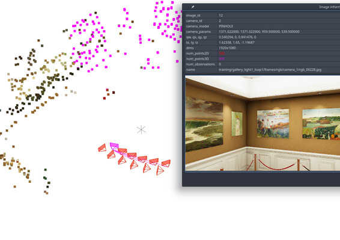

= kapture / quick start

:sectnums:
:sectnumlevels: 1
:toc:
:toclevels: 2

== install
[source,bash]
pip install kapture

NOTE: For this tutorial, you also must have __colmap__ version >=3.6.
On ubuntu 18.04, apt you will install __colmap__ 3.4.
In this case, you will have to compile__colmap__from source instead.

Or you can use the ready-to-use docker image:
[source,bash]
----
docker build . -t kapture
docker run -it --rm  --volume /path/to/dataset/:/dataset kapture   #  <1>
----
(1) replace `/path/to/dataset/` with the path on the host.

See link:installation.adoc[installation] for detailed instructions.

== download a dataset

[source,bash]
----
cd WHEREVER/YOU/WANT/THE/DATASESTS
# update the list from repositories
kapture_dataset_download.py update
# display the list dataset
kapture_dataset_download.py list
# install all variants of silda dataset
kapture_dataset_download.py install "silda*"  # <1>
----

<1> uses double quotes (`"`) to make sure the wildcard (`*`) is not catch by bash.

== convert

== visualize

== localization pipelines

In this tutorial, you will learn how localize query images on a map.
You will first see how to build the map through structure-from-motion technique, using known poses.
Then, you will localize query images.
And finally, you will evaluate the precision of the obtained localization against the ground truth.
In this tutorial we will use `virtual_gallery_tutorial` dataset, you will find in `samples/` folder.
You can easily reproduce the procedure for any dataset split in mapping/query.

.Colmap
For this tutorial, you must have __colmap__ version >=3.6. see <<install>>.

For __windows__ users, you must use `colmap.bat`. If the __colmap__ path is not available from your `%PATH%`
environment variable, you must provide it to kapture tools through the parameter `-colmap`,
e.g. `-colmap C:/Workspace/dev/colmap/colmap.bat`.

=== custom local features and matching based on image retrieval
First, you need to extract your local and global features for each image.
In kapture, there isn't any code for this.
We provide precomputed __R2D2__ (only 500 keypoints per image) and __AP-GeM__ features but for `samples/virtual_gallery_tutorial`.
If you want to process your own dataset, you will have to convert yours to the correct format
(see kapture_format.adoc#4--reconstruction).

0) Make sure, you start the tutorial cleaned from unwanted files (eg. previous experiments).

[source,bash]
----
cd samples/virtual_gallery_tutorial # or your own dataset
python ./reset_tutorial_folder.py
----

1) First step, proceed the image retrieval:

[source,bash]
----
# for each image, retrieve the 5 most similar images (including self)
# this will create a list of pairs of images
kapture_compute_image_pairs.py -v info --mapping ./mapping --query ./mapping -o ./tutorial/mapping_pairs.txt --topk 5
kapture_compute_image_pairs.py -v info --mapping ./mapping --query ./query -o ./tutorial/query_pairs.txt --topk 5
----

2) Next, you have to compute the 2D-2D matches using the local features and the list of
pairs.
[source,bash]
kapture_compute_matches.py -v info -i ./mapping --pairsfile-path ./tutorial/mapping_pairs.txt

3) Then build the map using colmap.
[source,bash]
----
# triangulate matches
# if the colmap executable is not available from your PATH,
# set the parameter -colmap. example -colmap C:/Workspace/dev/colmap/colmap.bat
# in kapture_colmap_build_map.py, every unknown parameter is passed down to colmap point_triangulator.
# In this example point_triangulator will take
# --Mapper.ba_refine_focal_length 0 --Mapper.ba_refine_principal_point 0 --Mapper.ba_refine_extra_params 0
kapture_colmap_build_map.py -v info -i ./mapping --pairsfile-path ./tutorial/mapping_pairs.txt -o ./tutorial/mapping_colmap --use-colmap-matches-importer --Mapper.ba_refine_focal_length 0 --Mapper.ba_refine_principal_point 0 --Mapper.ba_refine_extra_params 0
----

To visualise the map, you can use __colmap__ gui, as follow:
[source,bash]
colmap gui --database_path ./tutorial/mapping_colmap/colmap.db --image_path ./mapping/sensors/records_data

NOTE: For windows user, replace "colmap" with the full path to "colmap.bat" file.

Once __colmap__ window appears, click menu `file` > `import model` and browse to `tutorial/mapping_colmap/reconstruction`.
Click `yes` and `save` to the following dialogs. As show in Fig. <<fig_reconstruct>>, the 3-D interface of __colmap__
shows the 3-D points and the cameras in the scene. If you double-click on a camera, you'll see the image, and the 3-D
points seen from it will be highlighted.

NOTE: If you are using docker, you can simply use __colmap__ GUI from host, even if the version is < 3.6.

.map reconstruction in __colmap__.
[[fig_reconstruct]]

4) Merge: in order to run the localization scripts, you need to have the `mapping` and `query` data in the same kapture
(for the matches).
[source,bash]
----
# merge mapping and query. ignore global_features, they are not needed anymore
kapture_merge.py -v info -i ./mapping ./query -o ./tutorial/mapping_query -s global_features
# run the matching again, but with the query to mapping pairfile
kapture_compute_matches.py -v info -i ./tutorial/mapping_query --pairsfile-path ./tutorial/query_pairs.txt
----

5) Localize: Once `mapping` and `query` are merged to a single `mapping_query`, it's straightforward.
[source,bash]
----
# if the colmap executable is not available from your PATH,
# set the parameter -colmap. example -colmap C:/Workspace/dev/colmap/colmap.bat
# in kapture_colmap_localize.py, every unknown parameter is passed down to colmap image_registrator, in this example image_triangulator will take --Mapper.ba_refine_focal_length 0 --Mapper.ba_refine_principal_point 0 --Mapper.ba_refine_extra_params 0
kapture_colmap_localize.py -v info -i ./tutorial/mapping_query --pairsfile-path ./tutorial/query_pairs.txt -db ./tutorial/mapping_colmap/colmap.db -txt ./tutorial/mapping_colmap/reconstruction -o ./tutorial/localized_colmap --use-colmap-matches-importer --Mapper.ba_refine_focal_length 0 --Mapper.ba_refine_principal_point 0 --Mapper.ba_refine_extra_params 0
----

6) Evaluate: finally, import the results to kapture and evaluate your results.
[source,bash]
----
kapture_import_colmap.py -v info -db ./tutorial/localized_colmap/colmap.db -txt ./tutorial/localized_colmap/reconstruction -o ./tutorial/localized_colmap/imported --skip_reconstruction
# there are many more parameters in kapture_evaluate.py
# make sure to run kapture_evaluate.py --help
kapture_evaluate.py -v info -i ./tutorial/localized_colmap/imported --labels tutorial_localization -gt ./query -o ./tutorial/localized_colmap/eval --bins "0.01 0.1" "0.015 0.3" "0.2 0.5" --plot-max 10
----

In `./tutorial/localized_colmap/eval/stats.txt`, you will find something similar to:
[source,ini]
----
Model: tutorial_localization

Found 4 / 4 image positions (100.00 %).
Found 4 / 4 image rotations (100.00 %).
Localized images: mean=(0.0103m, 0.1710 deg) / median=(0.0097m, 0.1422 deg)
All: median=(0.0097m, 0.1422 deg)
Min: 0.0034m; 0.0602 deg
Max: 0.0183m; 0.3394 deg

(0.01m, 0.1 deg): 25.00%
(0.015m, 0.3 deg): 75.00%
(0.2m, 0.5 deg): 100.00%
----

=== using SIFT local features and Vocabulary Tree matching (standard colmap pipeline)

First, download a vocabulary tree file from https://demuc.de/colmap/. In this tutorial, we will use vocab_tree_flickr100K_words32K.bin

[source,bash]
----
cd samples/virtual_gallery_tutorial # or your own dataset
# if you use samples/virtual_gallery_tutorial, clear the tutorial folder of unwanted files
python ./reset_tutorial_folder.py

mkdir vocab_trees
# Windows 10 includes curl.exe
curl -C - --output ./vocab_trees/vocab_tree_flickr100K_words32K.bin --url https://demuc.de/colmap/vocab_tree_flickr100K_words32K.bin
----

Now you just have to run the kapture scripts.
[source,bash]
----
# build the map with colmap
# if the colmap executable is not available from your PATH,
# set the parameter -colmap. example -colmap C:/Workspace/dev/colmap/bin/colmap.bat
# in kapture_colmap_build_sift_map.py, every unknown parameter is passed down to colmap point_triangulator, in this example point_triangulator will take --Mapper.ba_refine_focal_length 0 --Mapper.ba_refine_principal_point 0 --Mapper.ba_refine_extra_params 0
kapture_colmap_build_sift_map.py -v info -i ./mapping -o ./tutorial/mapping_sift_colmap -voc ./vocab_trees/vocab_tree_flickr100K_words32K.bin --Mapper.ba_refine_focal_length 0 --Mapper.ba_refine_principal_point 0 --Mapper.ba_refine_extra_params 0

# localize with colmap
# if the colmap executable is not available from your PATH,
# set the parameter -colmap. example -colmap C:/Workspace/dev/colmap/bin/colmap.bat
# in kapture_colmap_localize_sift.py, every unknown parameter is passed down to colmap image_registrator, in this example image_registrator will take --Mapper.ba_refine_focal_length 0 --Mapper.ba_refine_principal_point 0 --Mapper.ba_refine_extra_params 0
kapture_colmap_localize_sift.py -v info -i ./query -db ./tutorial/mapping_sift_colmap/colmap.db -txt ./tutorial/mapping_sift_colmap/reconstruction -o ./tutorial/localized_sift_colmap -voc ./vocab_trees/vocab_tree_flickr100K_words32K.bin --Mapper.ba_refine_focal_length 0 --Mapper.ba_refine_principal_point 0 --Mapper.ba_refine_extra_params 0
----

Finally, import the results to kapture and evaluate your results.
[source,bash]
----
kapture_import_colmap.py -v info -db ./tutorial/localized_sift_colmap/colmap.db -txt ./tutorial/localized_sift_colmap/reconstruction -o ./tutorial/localized_sift_colmap/imported --skip_reconstruction
# there are many more parameters in kapture_evaluate.py
# make sure to run kapture_evaluate.py --help
kapture_evaluate.py -v info -i ./tutorial/localized_sift_colmap/imported --labels tutorial_localization -gt ./query -o ./tutorial/localized_sift_colmap/eval --bins "0.01 0.1" "0.015 0.3" "0.2 0.5" --plot-max 10
----

In `./tutorial/localized_sift_colmap/eval/stats.txt`, you will find something similar to:
[source,bash]
----
Model: tutorial_localization

Found 4 / 4 image positions (100.00 %).
Found 4 / 4 image rotations (100.00 %).
Localized images: mean=(0.0028m, 0.0425 deg) / median=(0.0025m, 0.0414 deg)
All: median=(0.0025m, 0.0414 deg)
Min: 0.0020m; 0.0317 deg
Max: 0.0041m; 0.0553 deg

(0.01m, 0.1 deg): 100.00%
(0.015m, 0.3 deg): 100.00%
(0.2m, 0.5 deg): 100.00%
----
