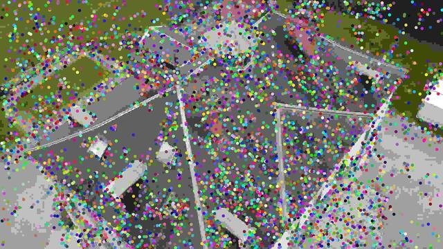

= kapture / quick start
:sectnums:
:sectnumlevels: 1
:toc:
:toclevels: 2

== Install
[source,bash]
pip install kapture

NOTE: For this tutorial, you also must have __colmap__ version >=3.6.
On ubuntu 18.04, __apt__ will install __colmap__ 3.4.
In this case, you will have to compile __colmap__ from source instead.

Or you can use the ready-to-use docker image:
[source,bash]
----
docker build . -t kapture/kapture
docker run --runtime=nvidia -it --rm  --volume /path/to/dataset/:/dataset kapture/kapture     # <1>
----
(1) replace `/path/to/dataset/` with the path where you (will) store datasets on the host.

See link:installation.adoc[installation] for detailed instructions.

== Download a dataset

[source,bash]
----
cd /path/to/dataset
# update the list from repositories
kapture_download_dataset.py update
# display the list dataset
kapture_download_dataset.py list
# install mapping and query of Extended-CMU-Seasons_slice22
kapture_download_dataset.py install "RobotCar_Seasons-v2_49_*"      # <1>
----

<1> uses double quotes (`"`) to make sure the wildcard (`*`) is not interpreted by bash.

== Convert a dataset to kapture

While we provide many datasets in __kapture__ format, you may want to convert datasets you already downloaded.

See https://github.com/naver/kapture/blob/main/doc/datasets.adoc for more details.

== Using kapture in your code

__kapture__ is also a python library, that you can use in your code.

=== Import package

To be able to `import kapture`, you should either :

 - install the kapture package (see <<install>>) or
 - add __kapture__  to the python path (eg. see below).

[source,python]
----
import sys
REPO_ROOT_PATH = '../..'  # change with the path to path to root directory
sys.path.insert(0, REPO_ROOT_PATH)
import kapture
----

=== Load a dataset

In this example, we will print out the positions of the devices stored in `trajectories.txt`.

First, load a dataset:

[source,python]
----
import kapture
import kapture.io.csv as csv

dataset_path = '../samples/virtual_gallery/kapture/training'
# keypoints, descriptors, matches, global features can be stored in tar files, so open them in advance
# use with csv.get_all_tar_handlers(dataset_path) as tar_handlers
# or call
# tar_handlers.close() before exiting the program
tar_handlers = csv.get_all_tar_handlers(dataset_path)
kapture_data = csv.kapture_from_dir(dataset_path, tar_handlers=tar_handlers)
----

=== Get poses

Then, loop over the stored positions, and print them:

[source,python]
----
# loop over the nested trajectories [timestamp][device_id] = pose -> position
for timestamps, poses in kapture_data.trajectories.items():
    print(f'timestamp: {timestamps:05d}')
    for sensor_id, pose in poses.items():
        print(f' └─ [{sensor_id}] = {pose.inverse().t.flatten()}')
----

NOTE: In trajectories, `pose` are transforms from world to device.
To obtain the position of the device (from device to world) you need to inverse the pose.

outputs :

[source,bash]
----
timestamp: 00000
 └─ [training_camera_0] = [-2.00292055 -1.65       -2.53706475]
 └─ [training_camera_1] = [-1.9039761  -1.65       -2.55155863]
 └─ [training_camera_2] = [-1.86705559 -1.65       -2.64449356]
 └─ [training_camera_3] = [-1.92907956 -1.65       -2.72293503]
 └─ [training_camera_4] = [-2.02802352 -1.65       -2.70844152]
 └─ [training_camera_5] = [-2.06494409 -1.65       -2.61550737]
timestamp: 00001
 └─ [training_camera_0] = [-2.06899583 -1.65       -2.3578293 ]
 └─ [training_camera_1] = [-1.97085445 -1.65       -2.37702379]
...
----

More simply, you can flatten the nested timestamps / device_id:

[source,python]
----
for timestamp, sensor_id, pose in kapture.flatten(kapture_data.trajectories, is_sorted=True):
    print(f'[{timestamp:05d}, {sensor_id}] = {pose.inverse().t.flatten()}')
----

outputs:

[source,bash]
----
[00000, training_camera_0] = [-2.00292055 -1.65       -2.53706475]
[00000, training_camera_1] = [-1.9039761  -1.65       -2.55155863]
[00000, training_camera_2] = [-1.86705559 -1.65       -2.64449356]
[00000, training_camera_3] = [-1.92907956 -1.65       -2.72293503]
[00000, training_camera_4] = [-2.02802352 -1.65       -2.70844152]
[00000, training_camera_5] = [-2.06494409 -1.65       -2.61550737]
[00001, training_camera_0] = [-2.06899583 -1.65       -2.3578293 ]
[00001, training_camera_1] = [-1.97085445 -1.65       -2.37702379]
...
----

=== Close handlers before quitting
[source,python]
----
tar_handlers.close()
----

=== Reconstruction

Let's have a look at the reconstruction. First, import more tools from kapture and load another sample dataset:

[source,python]
----
# imports some additional tools
from kapture.io.features import keypoints_to_filepaths, image_keypoints_from_file
from kapture.io.records import images_to_filepaths
from kapture.io.image import image_keypoints_to_image_file
from PIL import Image
from tqdm import tqdm
# load another dataset with reconstruction
dataset_path='../samples/maupertuis/kapture/'
tar_handlers = csv.get_all_tar_handlers(dataset_path)
kapture_data = csv.kapture_from_dir(dataset_path, tar_handlers=tar_handlers)
----

Let's see what is stored in __keypoints__, __descriptors__ and __matches__:
[source,python]
----
print(f'keypoints       :  {kapture_data.keypoints}')
print(f'descriptors     :  {kapture_data.descriptors}')
print(f'global_features :  {kapture_data.global_features}')
print(f'matches         :  {kapture_data.matches}')
print(f'observations    :\n{kapture_data.observations}')
print(f'points3d        :\n{kapture_data.points3d}')
----

output:

[source,bash]
----
keypoints       :  {'SIFT': SIFT (float32 x 6) = [
        02.jpg,
        00.jpg,
        01.jpg,
        03.jpg
]}
descriptors     :  {'SIFT': SIFT SIFT L2 (uint8 x 128) = [
        02.jpg,
        00.jpg,
        01.jpg,
        03.jpg
]}
global_features :  None
matches         :  {'SIFT': [
        (01.jpg , 02.jpg),
        (00.jpg , 01.jpg),
        (00.jpg , 03.jpg),
        (01.jpg , 03.jpg),
        (00.jpg , 02.jpg),
        (02.jpg , 03.jpg)
]}
observations    :
[00000, SIFT]:  (01.jpg, 4561)  (02.jpg, 3389)  (00.jpg, 4975)  (03.jpg, 3472)
[00001, SIFT]:  (01.jpg, 4557)  (02.jpg, 4128)  (00.jpg, 4970)
[00002, SIFT]:  (01.jpg, 4554)  (02.jpg, 3466)  (00.jpg, 4958)  (03.jpg, 3556)
....
[01036, SIFT]: 	(01.jpg, 2484)	(02.jpg, 3702)	(00.jpg, 2527)	(03.jpg, 3944)
[01037, SIFT]: 	(01.jpg, 2498)	(02.jpg, 2191)	(00.jpg, 2621)
[01038, SIFT]: 	(01.jpg, 2507)	(02.jpg, 1941)	(00.jpg, 2696)

points3d        :
[[ -2.39675   4.62278  13.2759   57.       57.       49.     ]
 [ -2.34421   4.5307   13.3448   63.       65.       62.     ]
 [ -1.1903    4.56941  13.7496  159.      161.      156.     ]
 ...
 [  1.82224   5.7889   17.4739  163.      165.      159.     ]
 [ -0.41245   5.08333  13.8041  119.      124.      129.     ]
 [ -1.54589   5.02867  13.463   100.       97.       89.     ]]
----

=== Keypoints

Then, we load the keypoints of the first image (`00.jpg`) as a numpy array using `image_keypoints_from_file`:

[source,python]
----
image_name = '00.jpg'
keypoints_type = 'SIFT'
# keypoints_filepaths[image_name] -> keypoints file full path
keypoints_filepaths = keypoints_to_filepaths(kapture_data.keypoints[keypoints_type], keypoints_type, dataset_path, tar_handlers)
# for image_name in kapture_data.keypoints:
keypoints_filepath = keypoints_filepaths[image_name]
keypoints_data = image_keypoints_from_file(filepath=keypoints_filepath,
                                           dsize=kapture_data.keypoints[keypoints_type].dsize,
                                           dtype=kapture_data.keypoints[keypoints_type].dtype)
print(f'keypoints of "{image_name}" as numpy array of {keypoints_data.dtype} and shape {keypoints_data.shape}:')
print(keypoints_data)
----

output:

[source,bash]
----
keypoints of "00.jpg" as numpy array of float32 and shape (6424, 6):
[[ 1.2909084e+03  4.1563606e+00 -1.3475049e+00  1.4732410e+00
  -1.4732410e+00 -1.3475049e+00]
 [ 6.2747311e+01  4.7568941e+00  1.1128439e-01  1.7677375e+00
  -1.7677375e+00  1.1128439e-01]
 [ 2.1730029e+02  4.4497972e+00  4.6869200e-01  2.0487530e+00
  -2.0487530e+00  4.6869200e-01]
 ...
 [ 3.5506705e+02  7.7944904e+02 -4.8760738e+01  4.1329781e+01
  -4.1329781e+01 -4.8760738e+01]
 [ 1.6452257e+03  6.0981189e+02  5.6920929e+01  5.7031525e+01
  -5.7031525e+01  5.6920929e+01]
 [ 1.3813167e+03  6.6880566e+02  5.9981022e+01  4.6423214e+01
  -4.6423214e+01  5.9981022e+01]]
----

There are similar functions for `descriptors`, `global_features` and `matches`.
For convienence, __kapture__ also provides function the `image_keypoints_to_image_file`,
to directly draw keypoints on top of an image:

[source,python]
----
# images_filepaths[image_name] -> image file full path
images_filepaths = images_to_filepaths(kapture_data.records_camera, kapture_dirpath)
for image_name in tqdm(kapture_data.keypoints[keypoints_type]):
    image_filepath = images_filepaths[image_name]
    keypoints_filepath = keypoints_filepaths[image_name]
    image_with_kp_filepath = keypoints_filepath + '_preview.jpg'
    with Image.open(image_filepath) as image:
        image_keypoints_to_image_file(
            output_filepath=image_with_kp_filepath,
            image_filepath=image_filepath,
            keypoints_filepath=keypoints_filepath,
            keypoint_dtype=kapture_data.keypoints[keypoints_type].dtype,
            keypoint_dsize=kapture_data.keypoints[keypoints_type].dsize,
            radius=6
        )
tar_handlers.close()
----

Saved in `../samples/maupertuis/kapture/reconstruction/keypoints/00.jpg.kpt_preview.png`, you will find:

.SIFT keypoints overlaid on top of the image.

== Mapping and Localization pipelines

Mapping and localization pipelines are available in https://github.com/naver/kapture-localization[kapture-localization].
See https://github.com/naver/kapture-localization/blob/main/doc/tutorial.adoc for more details.
