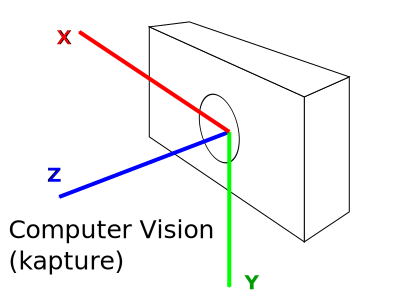
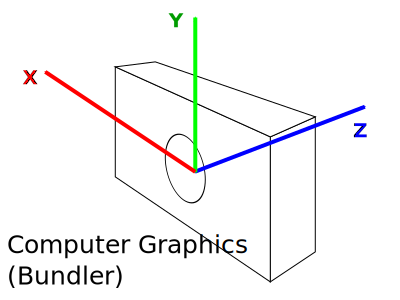
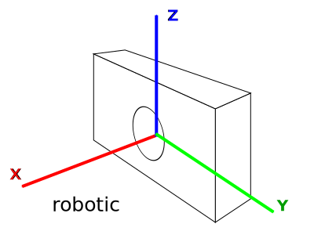

= image:assets/kapture_newlogo.png["KAPTURE", width=64px] kapture:  data format v1.1
:sectnums:
:sectnumlevels: 1
:toc:
:toclevels: 2

This document defines the __kapture__ pivot file format, used to describe SfM (Structure From Motion)
and more generally sensor-acquired data.
This format aims to be as simple as possible, and thus relies on text and binary files.
Here is an example of __kapture__ folder:

[source,txt]
.example of a kapture dataset
----
my_dataset                          # Data root path
├─ sensors/                         # Sensor data root path
│  ├─ sensors.txt                   # list of all sensors with their specifications (required)
│  ├─ rigs.txt                      # rigid geometric relationship between sensors
│  ├─ trajectories.txt              # extrinsics (timestamp, sensor, pose)
│  ├─ records_camera.txt            # recording of 'camera' (timestamp, sensor id and path to image)
│  ├─ records_depth.txt             # recording of 'depth' (timestamp, sensor id and path to depth map)
│  ├─ records_gnss.txt              # recording of 'GNSS' (timestamp, sensor id, location and ...)
│  ├─ records_lidar.txt             # recording of 'lidar' (timestamp, sensor id and path to lidar data)
│  ├─ records_wifi.txt              # recording of 'wifi' (timestamp, sensor id and wifi measurements)
│  ├─ records_SENSOR_TYPE.txt       # SENSOR_TYPE is replaced with custom type. (eg. 'magnetic', 'pressure' ...)
│  └─ records_data/                 # image and lidar data root path
│     ├─ mapping/cam_01/00001.jpg   # example of image path used in records_camera.txt
│     ├─ mapping/cam_01/00001.depth # example of depth map used in records_depth.txt
│     ├─ mapping/cam_01/00002.jpg
│     ├─ mapping/cam_01/00002.depth
│     ├─ mapping/lidar_01/0001.pcd  # example of lidar data path used in records_lidar.txt
│     ├─ query/query001.jpg         # example of image path used in records_camera.txt
│     └─ ...
└─ reconstruction/
   ├─ keypoints/                            # 2D keypoints files
   │  ├─ r2d2_WASF-N8_20k                   # identify the type of keypoints
   │  │  ├─ keypoints.txt                   # type of keypoint (shape and dtype)
   │  │  ├─ mapping/cam_01/00001.jpg.kpt    # keypoints for corresponding image (example)
   │  │  ├─ query/query001.jpg.kpt          # keypoints for corresponding image (example)
   │  │  ├─ ...
   │  ├─ d2_tf                              # identify the type of keypoints
   │  │  ├─ keypoints.txt                   # type of keypoint (shape and dtype)
   │  │  ├─ keypoints.tar                   # instead of regular files, you can use an archive
   │  │  │  ├─ mapping/cam_01/00001.jpg.kpt # keypoints for corresponding image (example)
   │  │  │  ├─ query/query001.jpg.kpt       # keypoints for corresponding image (example)
   │  │  │  ├─ ...
   │  ├─ ...
   ├─ descriptors/                          # keypoint descriptors files
   │  ├─ r2d2_WASF-N8_20k                   # identify the type of descriptors
   │  │  ├─ descriptors.txt                 # type of descriptor (keypoints type, shape and dtype)
   │  │  ├─ mapping/cam_01/00001.jpg.desc   # descriptors for corresponding image (example)
   │  │  ├─ query/query001.jpg.desc         # descriptors for corresponding image (example)
   │  │  ├─ ...
   │  ├─ d2_tf                              # identify the type of descriptors
   │  │  ├─ descriptors.txt                 # type of descriptor
   │  │  ├─ descriptors.tar                 # instead of regular files, you can use an archive
   │  │  │  ├─ mapping/cam_01/00001.jpg.desc # descriptors for corresponding image (example)
   │  │  │  ├─ query/query001.jpg.desc      # descriptors for corresponding image (example)
   │  │  │  ├─ ...
   │  ├─ ...
   ├─ points3d.txt                          # 3D points of the reconstruction
   ├─ observations.txt                      # 2D/3D points corespondences
   ├─ matches/                              # matches files.
   │  ├─ r2d2_WASF-N8_20k                   # identify the type of keypoints that are matched
   │  │  ├─ mapping/cam_01/00001.jpg.overlapping/cam_01/00002.jpg.matches # example
   │  │  ├─  ...
   │  ├─ d2_tf                              # identify the type of keypoints that are matched
   │  │  ├─ matches.tar                     # instead of regular files, you can use an archive
   │  │  │  ├─ mapping/cam_01/00001.jpg.overlapping/cam_01/00002.jpg.matches # example
   │  │  │  ├─  ...
   │  ├─ ...
   └─ global_features/                      # global feature files
      ├─ AP-GeM-LM18                        # identify the type of global_features
      │  ├─ global_features.txt             # type of global feature
      │  ├─ mapping/cam_01/00001.jpg.gfeat  # example of global feature for corresponding image
      │  ├─ query/query001.jpg.gfeat        # example of global feature for corresponding image
      │  └─ ...
      ├─ DELG                               # identify the type of global_features
      │  ├─ global_features.txt             # type of global feature
      │  ├─ global_features.tar             # instead of regular files, you can use an archive
      │  │  ├─ mapping/cam_01/00001.jpg.gfeat # example of global feature for corresponding image
      │  │  ├─ query/query001.jpg.gfeat     # example of global feature for corresponding image
      │  │  └─ ...
      ├─ ...
----


== File Structure

The __kapture__ files are split in 2 sub-folders,

 - **sensors** (raw sensor data) on one side,
 - and **reconstruction** (result of computation) on the other side.

Except `sensors.txt`, every files are optionals, and their presence depends
on the acquisition platform and the processing.
Files are either text files, or binary files.
Both text and binary files must comply a common set of rules, defined bellow.

The way data are organised in some directories (eg. `sensors/records_data/`)
is left to user convenience. Nevertheless, we usually use this
https://github.com/naver/kapture-localization/blob/main/doc/tutorial.adoc#recommended-dataset-structure[folder structure] for our experiments.
For example, there can be one kapture for mapping and one for query.
The images could be stored in one location (here you could have both, mapping and query images)
and the records_data folders could be symbolic links to this location.

In the https://github.com/naver/kapture-localization/blob/main/doc/tutorial.adoc#examples[pipeline examples],
the recommended data structure will be used and this hopefully helps to understand.

=== sensors
The `sensors` part of __kapture__ data contains the acquired data as well as the sensors characteristics.
The sensors can be cameras but also lidars, wifi, magnetic, pressure or any other sensor.
In the case of cameras, the acquired data are the images, and the sensor characteristics are the
poses (a.k.a extrinsics) and the intrinsic parameters of the cameras.

=== reconstruction
The `reconstruction` part of __kapture__ data contains the result of processing on the sensor data.
It can be:

- keypoints in images,
- keypoints matching,
- image global feature,
- 3d reconstruction.

=== Text files (`.txt`):

Text files must comply the following:

 - utf-8 files,
 - starts with # kapture format: 1.1 (in fact the version is read from sensors.txt only, but it's added to all files)
 - comma separated values (CSV), spaces around comma are ignored,
 - as a consequence, values (eg. path) **must not contains `,` (comma)**,
 - each line excect for the first (version) starting with `#` (comments), as well as lines containing only blank characters are ignored.

=== Binary files

Text files must comply the following:

 - with extensions `.depth`, `.pcb`, `.kpt`, `.desc`, `.gfeat`, `.matches`,
 - raw binary dump (eg. raw dump of floats),
 - little-endian,
 - for the reconstruction files, the actual data type is described in the corresponding text file
        (eg. `reconstruction/keypoints/keypoints.txt`)

=== Support for tar files

It is possible to put some of the features inside with a tar.
To be precise, for every subfolders of `keypoints`, `descriptors`, `global_features` and `matches`, the features/matches files can be stored inside a tar named `keypoints.tar`, `descriptors.tar`, `global_features.tar` or `matches.tar`.
For example :
```
reconstruction/
├─ keypoints/
│  ├─ r2d2_WASF-N8_20k              # identify the type of keypoints
│  │  ├─ keypoints.txt              # type of keypoint (shape and dtype)
│  │  ├─ mapping/cam_01/00001.jpg.kpt   # keypoints for corresponding image (example)
│  │  ├─ query/query001.jpg.kpt     # keypoints for corresponding image (example)
│  │  ├─ ...

become

reconstruction/
├─ keypoints/ 
│  ├─ r2d2_WASF-N8_20k                 # identify the type of keypoints
│  │  ├─ keypoints.txt                 # type of keypoint (shape and dtype)
│  │  ├─ keypoints.tar                 # instead of regular files, you can use an archive
│  │  │  ├─ mapping/cam_01/00001.jpg.kpt   # inside the tar, filename is the same as above
│  │  │  ├─ query/query001.jpg.kpt     # inside the tar, filename is the same as above
│  │  │  ├─ ...
```

The content of the tar file should be identical to the folder it replaces. 
Read OR Append operations are supported, you have to chose which. It is recommended to start using tar when all features are already computed.
The advantage of tarfile compared to normal folders is that it's faster to copy/move and estimate size.

Note that overwriting a file within the tar with result in wasted space (the updated file will be appended to the tar file) so be careful.

The scripts in kapture such as import_colmap_py will never create a tar, they will export features to regular files.
It is up to the user to tar the features if they so desire.

In order to use the tar files, you will have to open them before loading the kapture data:
```
# in read mode:
keypoints_type = 'r2d2_WASF_N8_20k'
with get_all_tar_handlers(kapture_root_dir) as tar_handlers:
   kapture_data = kapture_from_dir(kapture_root_dir, tar_handlers=tar_handlers)
   images = [image_name for _, _, image_name in kapture.flatten(kapture_data.records_camera)]
   for image_name in images:
      # if keypoints are not in a tar, keypoints_path will be a string with full path to the file
      # if keypoints are in a tar, keypoints_path will be a pair (filename, tar_handler)
      keypoints_path = get_keypoints_fullpath(keypoints_type, kapture_root_dir, image_name, tar_handlers)
      keypoints = image_keypoints_from_file(keypoints_path, kapture_data.keypoints[keypoints_type].dtype, kapture_data.keypoints[keypoints_type].dsize)

# keypoints and descriptors in append mode
with get_all_tar_handlers(kapture_root_dir, mode={kapture.Keypoints: 'a', kapture.Descriptors: 'a'}) as tar_handlers:
   kapture_data = kapture_from_dir(kapture_root_dir, tar_handlers=tar_handlers)
   images = [image_name for _, _, image_name in kapture.flatten(kapture_data.records_camera)]
   for image_name in images:
      # if keypoints are not in a tar, keypoints_path will be a string with full path to the file
      # if keypoints are in a tar, keypoints_path will be a pair (filename, tar_handler)
      keypoints_path = get_keypoints_fullpath(keypoints_type, kapture_root_dir, image_name, tar_handlers)
      keypoints = np.zeros((0, 128), dtype=np.float64)
      keypoints = image_keypoints_to_file(keypoints_path, keypoints)
```

== `├─ sensors/`

This folder contains sensor data. Meaning the acquired data as well as the sensors characteristics.
The sensors can be cameras but also lidars, wifi, magnetic, pressure or any other sensor.
In the case of cameras, the acquired data are the images, and the sensor characteristics are the
poses (a.k.a extrinsics) and the intrinsic parameters of the cameras.

=== `│ ├─ sensors.txt`

This file lists all sensors that have records in the dataset, using one line per physical sensor.
It can also contain the intrinsic parameters of sensors. This file is required.

==== syntax

Each line of the file is composed of :
[source,txt]
----
sensor_device_id, name, sensor_type, [sensor_params]+
----

with:

[cols=">1m,^1e,4",options="header"]
|===
|            field | type   | description
| sensor_device_id | string | The unique identifier of sensor.
|             name | string | the name of the sensor (eg. Hero7). Can be empty.
|      sensor_type | string | The type of sensor among :
                              `camera`, `depth`, `gnss`, `lidar`, `wifi`, `magnetic` or `pressure`.
| [sensor_params]+ | list   | The sensor parameters. It depends on sensor_type.
                              See below for the different types of records and their parameters.
|===

==== camera / depth

In the case of `sensor_type` is `camera` (or `depth`), `[sensor_params]` contains :

[cols=">1m,^1e,4",options="header"]
|===
|            field | type   | description
|            model | string |  the name of the sensors model used, usually a camera projection (same as in https://github.com/colmap/colmap/blob/dev/scripts/python/read_write_model.py#L56[colmap]):
                                SIMPLE_PINHOLE, PINHOLE, SIMPLE_RADIAL, RADIAL, OPENCV, OPENCV_FISHEYE, FULL_OPENCV, FOV, SIMPLE_RADIAL_FISHEYE, RADIAL_FISHEYE, THIN_PRISM_FISHEYE, UNKNOWN_CAMERA
|     model_params | list of floats | parameters of the projection model, usually starts with image size, but depends of the model. (see https://github.com/colmap/colmap/blob/dev/src/base/camera_models.h#L275[colmap] and examples below).
|===


[cols=">1m,4m",options="header"]
|===
| model          | parameters
| UNKNOWN_CAMERA | w, h
| SIMPLE_PINHOLE | w, h, f, cx, cy
| SIMPLE_RADIAL  | w, h, f, cx, cy, k
| RADIAL         | w, h, f, cx, cy, k1, k2
| PINHOLE        | w, h, fx, fy, cx, cy
| OPENCV         | w, h, fx, fy, cx, cy, k1, k2, p1, p2
| FULL_OPENCV    | w, h, fx, fy, cx, cy, k1, k2, p1, p2, k3, k4, k5, k6
|===

with `w` and `h` standing for image with and height. See source conde for other parameters.

WARNING: point to our code instead when available

==== gnss (a.k.a GPS)

In the case of `sensor_type` is `gnss`, `[sensor_params]` contains :

[cols=">1m,^1e,4",options="header"]
|===
|            field | type   | description
|             EPSG | string | Coordinates system used. If empty, assumed `EPSG:4326` for standard WGS84 GPS coordinates.
|===

==== lidar

TODO

==== wifi

Wifi sensor does not have intrinsic parameters.

==== Other sensors

Currently, there is no specific parameters for the other sensors supported.

==== example

.sensors/sensors.txt
[source,txt]
----
# kapture format: 1.1
# sensor_device_id, name, sensor_type, [sensor_params]+
cam01, Hero7, camera, FULL_OPENCV, 800, 600, 600, 600, 300, 300, 0.,  0.,  0.,  0.,  0.,  0.,  0.,  0.
depth01, kinect, camera, SIMPLE_PINHOLE, 800, 600, 600, 400, 300
phone0, gs9, camera, SIMPLE_RADIAL, 2988, 5312, 2770, 1494, 2656, -0.035
phone01wifi, , wifi
lidar0, , lidar
lidar1, , lidar
gps1, , gnss, EPSG:4326
----

=== `│ ├─ rigs.txt`

It contains the geometric relationship between sensors.
When multiple sensors are mounted on the same rig, their relative position is fixed and thus never changes.

This can be leveraged by some algorithms like bundle adjustment.

==== syntax

Each line of the file is composed of :
[source,txt]
----
rig_device_id, sensor_device_id, qw, qx, qy, qz, tx, ty, tz
----

with:

[cols=">1m,^1e,4",options="header"]
|===
|            field | type   | description
|    rig_device_id | string | Unique identifier of the rig. This `device_id` *must not* be in `sensors.txt`.
| sensor_device_id | string | Unique identifier of the sensor. This `device_id` *must* be in `sensors.txt`.
|   qw, qx, qy, qz | float (x4)| The rotation quaternion from rig to sensor.
|       tx, ty, tz | float (x3)| The translation vector from rig to sensor.
|===

==== example

.sensors/rigs.txt
[source,txt]
----
# kapture format: 1.1
# rig_device_id, sensor_device_id, qw, qx, qy, qz, tx, ty, tz
rig, cam01, 1, 0, 0, 0, 0, 0, 0
rig, cam02, 1, 0, 0, 0, 10, 0, 0
rig, phone01wifi, 1, 0, 0, 0, -10, 0, 0
----

=== `│ ├─ trajectories.txt`

This file contains the pose of all devices (sensor or rig) in the dataset using one line per (timestamp, device_id).
This file is optional. However, it is required by many algorithms, so if it is missing,
only a subset of the tools will be useful.
The file is usually ordered by timestamp and device_id, but it is only by implementation choice. Do not rely on this,
or order the data yourself if you need an ordering.

==== syntax

each line of the file follow this syntax:

[source,txt]
----
timestamp, device_id, qw, qx, qy, qz, tx, ty, tz
----

with:

[cols=">1m,^1e,4",options="header"]
|===
|            field | type   | description
|        timestamp | uint32 | The timestamp as an integer. Can be POSIX timestamp, a sequence number, or any other ID to designate the record.
|        device_id | string | Unique identifier of the sensor or rig.
|   qw, qx, qy, qz | float (x4)| The rotation quaternion from world to device (same as in colmap).
|       tx, ty, tz | float (x3)| The translation vector from world to device (same as in colmap).
|===

==== example

.sensors/trajectories.txt
[source,txt]
----
# kapture format: 1.1
# timestamp, device_id, qw, qx, qy, qz, tx, ty, tz
0000, cam01, 1, 0, 0, 0, 0, 0, 0
0000, cam02, 1, 0, 0, 0, 0, 0, 0
0001, cam01, 1, 0, 0, 0, 1, 0, 0
0001, cam02, 1, 0, 0, 0, 1, 0, 0
----

=== `│ ├─ records_camera.txt`

This file defines the images in the dataset, using one line per snapshot.

==== syntax

each line of the file follow this syntax:

[source,txt]
----
timestamp, device_id, image_path
----

with:

[cols=">1m,^1e,4",options="header"]
|===
|            field | type   | description
|        timestamp | uint32 | The timestamp as an integer. Can be POSIX timestamp, a sequence number, or any other ID to designate the record.
|        device_id | string | Unique identifier of the sensor. This `device_id` *must* be in `sensors.txt`.
|       image_path | path   | Path to the image file. The path is relative to `sensors/records_data/`.
|===

==== example

.sensors/records_camera.txt
[source,txt]
----
# kapture format: 1.1
# timestamp, device_id, image_path
0000, cam01, mapping/cam_01/00001.jpg
0000, cam02, mapping/cam_02/00001.jpg
0001, cam01, mapping/cam_01/00003.jpg
0001, cam02, query/query003.jpg
----

=== `│ ├─ records_depth.txt`

This file defines the depth maps in the dataset, using one line per snapshot.

==== syntax

each line of the file follow this syntax:

[source,txt]
----
timestamp, device_id, depth_map_path
----

with:

[cols=">1m,^1e,4",options="header"]
|===
|            field | type   | description
|        timestamp | uint32 | The timestamp as an integer. Can be POSIX timestamp, a sequence number, or any other ID to designate the record.
|        device_id | string | Unique identifier of the sensor. This `device_id` *must* be in `sensors.txt`.
|   depth_map_path | path   | Path to the depth map file. The path is relative to `sensors/records_data/`.
|===

==== example

.sensors/records_depth.txt
[source,txt]
----
# kapture format: 1.1
# timestamp, device_id, depth_map_path
0000, depth01, mapping/cam_01/00001.depth
0000, depth02, mapping/cam_02/00001.depth
0001, depth01, mapping/cam_01/00003.depth
0001, depth02, query/query003.depth
----

==== TIPS

If images and depth maps come from a single sensor (same field of view, same timestamps),
you should define a rig including both camera and depth sensor. Thus you can define
a single trajectory for the rig, and it will automatically be defined for both images and depth sensors.
For example:

.sensors/rigs.txt
[source,txt]
----
# kapture format: 1.1
# rig_device_id, sensor_device_id, qw, qx, qy, qz, tx, ty, tz
RGBD_01, cam01, 1, 0, 0, 0, 0, 0, 0
RGBD_01, depth01, 1, 0, 0, 0, 0, 0, 0
----

=== `│ ├─ records_gnss.txt`

This file defines the GNSS (a.k.a. GPS) in the dataset per timestamp.

==== syntax

each line of the file follow this syntax:

[source,txt]
----
timestamp, device_id, x, y, z, utc, dop
----

with:

[cols=">1m,^1e,4",options="header"]
|===
|            field  | type   | description
|        timestamp  | uint32 | The timestamp in same time referential as other sensors (not GNSS clock).
|        device_id  | string | Unique identifier of the sensor. This `device_id` *must* be in `sensors.txt`.
|          x, y, z  | float  | Coordinates. If `EPSG` in `sensors.txt` is set to `EPSG:4326`, coordinates are
                                longitude (x) in degrees, latitude (y) in degrees, altitude (z) in meters.
|              utc  | uint32 | The UTC timestamp provided by GNSS clock in Unix format. `0` if not available.
|              dop  | float  | The dilution of precision given by GNSS device. `0` if not available.
|===


=== `│ ├─ records_lidar.txt`

This file defines the lidar point clouds in the dataset per timestamp.

==== syntax

each line of the file follow this syntax:

[source,txt]
----
timestamp, device_id, point_cloud_path
----

with:

[cols=">1m,^1e,4",options="header"]
|===
|            field  | type   | description
|        timestamp  | uint32 | The timestamp as an integer. Can be POSIX timestamp, a sequence number, or any other ID to designate the record.
|        device_id  | string | Unique identifier of the sensor. This `device_id` *must* be in `sensors.txt`.
|  point_cloud_path | path   | Path to the point cloud file. The path is relative to `sensors/records_data/`.
|===

=== `│ ├─ records_wifi.txt`

This file defines the wifi recordings in the dataset per timestamp.

==== syntax

each line of the file follow this syntax:

[source,txt]
timestamp, device_id, BSSID, frequency, RSSI, SSID, scan_time_start, scan_time_end

with:

[cols=">1m,^1e,4",options="header"]
|===
|            field  | type   | description
|        timestamp  | uint32 | The timestamp as an integer. Can be POSIX timestamp, a sequence number,
                                or any other ID to designate when this result was last seen.
                                There is no guarantee `timestamp` lies into the range of
                                [`scan_time_start`..`scan_time_end`].
|        device_id  | string | Unique identifier of the sensor. This `device_id` *must* be in `sensors.txt`.
|            BSSID  | string | Basic service set identifiers (BSSID) of the record.
|        frequency  | uint32 | WiFi frequency bands in Hz.
|             RSSI  | float  | Received Signal Strength Indicator.
|             SSID  | string | The network name.
|  scan_time_start  | uint32 | The timestamp when scanning started. 0 means undefined.
|    scan_time_end  | uint32 | The timestamp when scanning ended. 0 means undefined.
|===

==== example

.sensors/records_wifi.txt
[source,txt]
----
# kapture format: 1.1
# timestamp, device_id, BSSID, frequency, RSSI, SSID, scan_time_start, scan_time_end
0, phone01wifi, BA:98:76:54:32:10, 2400, 120.0, , 0, 10
0, phone01wifi, 01:23:45:67:89:AB, 2400,  33.0, , 0, 10
1, phone01wifi, 24:a4:3c:9e:d2:84, 2400, 122.0, , 0, 10
----

=== `│ ├─ records_bluetooth.txt`

This file defines the bluetooth recordings in the dataset per timestamp.

==== syntax

each line of the file follow this syntax:

[source,txt]
timestamp, device_id, address, RSSI, name

with:

[cols=">1m,^1e,4",options="header"]
|===
|            field  | type   | description
|        timestamp  | uint32 | The timestamp as an integer. Can be POSIX timestamp, a sequence number,
                                or any other ID to designate when this result was last seen.
|        device_id  | string | Unique identifier of the sensor. This `device_id` *must* be in `sensors.txt`.
|          address  | string | The remote device identifiers.
|             RSSI  | float  | Received Signal Strength Indicator.
|             name  | string | The remote device name.
|===


=== `│ ├─ records_accelerometer.txt`

This file defines the accelerometer recordings in the dataset per timestamp.

==== syntax

each line of the file follow this syntax:

[source,txt]
timestamp, device_id, x_acc, y_acc, z_acc

with:

[cols=">1m,^1e,4",options="header"]
|===
|            field  | type   | description
|        timestamp  | uint32 | The timestamp as an integer. Can be POSIX timestamp, a sequence number,
                                or any other ID to designate when this result was last seen.
|        device_id  | string | Unique identifier of the sensor. This `device_id` *must* be in `sensors.txt`.
|            x_acc  | float  | The acceleration along X axis.
|            y_acc  | float  | The acceleration along Y axis.
|            z_acc  | float  | The acceleration along Z axis.
|===


=== `│ ├─ records_gyroscope.txt`

This file defines the gyroscope recordings in the dataset per timestamp.

==== syntax

each line of the file follow this syntax:

[source,txt]
timestamp, device_id, x_speed, y_speed, z_speed

with:

[cols=">1m,^1e,4",options="header"]
|===
|            field  | type   | description
|        timestamp  | uint32 | The timestamp as an integer. Can be POSIX timestamp, a sequence number,
                                or any other ID to designate when this result was last seen.
|        device_id  | string | Unique identifier of the sensor. This `device_id` *must* be in `sensors.txt`.
|          x_speed  | float  | The rotation speed around X axis.
|          y_speed  | float  | The rotation speed around Y axis.
|          z_speed  | float  | The rotation speed around Z axis.
|===


=== `│ ├─ records_magnetic.txt`

This file defines the magnetic recordings in the dataset per timestamp.

==== syntax

each line of the file follow this syntax:

[source,txt]
timestamp, device_id, x_strength, y_strength, z_strength

with:

[cols=">1m,^1e,4",options="header"]
|===
|            field  | type   | description
|        timestamp  | uint32 | The timestamp as an integer. Can be POSIX timestamp, a sequence number,
                                or any other ID to designate when this result was last seen.
|        device_id  | string | Unique identifier of the sensor. This `device_id` *must* be in `sensors.txt`.
|       x_strength  | float  | The strength of the magnetic field along X axis.
|       y_strength  | float  | The strength of the magnetic field along Y axis.
|       z_strength  | float  | The strength of the magnetic field along Z axis.
|===


=== `│  ├─ records_SENSOR_TYPE.txt`

These files defines snapshot of a custom (not specified) sensor.

==== syntax

where each line of the file follow this syntax:

[source,txt]
----
timestamp, device_id, data
----

[cols=">1m,^1e,4",options="header"]
|===
|            field | type   | description
|        timestamp | uint32 | The timestamp as an integer. Can be POSIX timestamp, a sequence number, or any other ID to designate the record.|        device_id | string | Unique identifier of the sensor or rig.
|             data | path \| list of parameters | Depends of each sensor type: either a path to data files or a list of parameters.
|===

==== example

.records_SENSOR_TYPE.txt
[source,txt]
----
# kapture format: 1.1
# timestamp, device_id, data_or_filepath
0, 0, my_custom_sensor/0000.dat
1, 0, my_custom_sensor/0001.dat
----

For cameras and lidars, it is not possible to store the record (image or point cloud) in the records file, so it is stored in the `sensors/records_data/` subdirectory, and the records file only contains a relative path to the actual data file.


=== `│ ├─ records_data/`

Root path of sensing data binary files (eg. images, depth maps, lidar point clouds).
There are no constraints on the structure of the sub-folders.

This flexibility allows usage of existing data hierarchies (e.g. academic datasets)
without having to copy all the files into a specific structure.

For instance, it is possible to group data files per sensor,
or to create distinct hierarchies for mapping data (or train data) and query data (or test data).

.records_data/ example
----
└─ sensors/                         # Sensor data root path
   └─ records_data/                 # image, depth maps and lidar data root path
      ├─ mapping
      │  ├─ cam_01/
      │  │  ├─ 00001.jpg
      │  │  ├─ 00001.depth
      │  │  ├─ 00002.jpg
      │  │  └─ 00002.depth
      │  ├─ cam_02/
      │  │  ├─ 00001.jpg
      │  │  ├─ 00001.depth
      │  │  ├─ 00002.jpg
      │  │  └─ 00002.depth
      │  └─ lidar_01/
      │     ├─ 0000001.pcd
      │     └─ 0000002.pcd
      └─ query
         ├─ query001.jpg
         ├─ query001.depth
         ├─ query002.jpg
         ├─ query002.depth
         ├─ query003.jpg
         └─ query003.depth
----

=== `│ ├─ records_data/*.depth`

A single depth file contains a single depth map.

==== syntax

A `.depth` file is an array of float formatted as binary.
The data type of the array is signed float on 32 bits.
Each float value represent a distance in meters from the sensor origin plane.
The size of the array is specified in the sensor parameters (sensors.txt).
The first pixel of the array correspond to the upper left corner.
The second pixel is the next on the row, and so on.

== `├─ reconstruction/`

The `reconstruction` part of __kapture__ contains the result of processing.

=== `│ ├─ keypoints/`

This directory contains image key-points related files.

=== `│ │ ├─ keypoints_type/`
==== structure

Each subdirectory correspond to a different type of keypoint.
The subdirectories are organised as follow:

 - `keypoints.txt` files describes the type of key-points (shape and dtype),
 - a set of binary `.kpt` files describes key-points of images.
   There is one key-points file per image, and the file tree must
  *strictly follow the same path and naming* as `sensors/records_data/`.

==== example

.reconstruction/keypoints/
----
├─ reconstruction/
│  ├─ keypoints/                       # 2D keypoints files
│  │  ├─ r2d2_WASF-N8_20k
│  │  │  ├─ keypoints.txt              # type of keypoint
│  │  │  ├─ mapping/cam_01/00001.jpg.kpt   # example of keypoints for corresponding image
│  │  │  ├─ query/query001.jpg.kpt     # example of keypoints for corresponding image
│  │  │  ├─ ...
│  │  ├─ d2_tf
│  │  │  ├─ keypoints.txt              # type of keypoint
│  │  │  ├─ mapping/cam_01/00001.jpg.kpt   # example of keypoints for corresponding image
│  │  │  ├─ query/query001.jpg.kpt     # example of keypoints for corresponding image
│  │  │  ├─ ...
│  │  ├─ ...
----

=== `│ │ │ ├─ keypoints.txt`

This text file describes the type of key-points.

==== syntax

The file contains a single line, following this syntax:

[source,txt]
----
name, dtype, dsize
----

with:

[cols=">1m,^1e,4",options="header"]
|===
|            field | type   | description
|             name | string | The name of the detector, for information only.
|            dtype | string | type of data. Can be native python type or numpy type (without the numpy prefix).
|            dsize | int    | number of data per key-point.
|===

It may also optionally contains some comments (lines starting with `#`) or blank lines.

==== examples

.reconstruction/keypoints/r2d2_WASF-N8_20k/keypoints.txt
[source,txt]
----
# kapture format: 1.1
# name, dtype, dsize
r2d2, float32, 3
----

.reconstruction/keypoints/SIFT/keypoints.txt
[source,txt]
----
# kapture format: 1.1
# name, dtype, dsize
SIFT, float32, 4
----

=== `│ │ │ ├─ *.kpt`

Contains all key-points of a single image using one line per key-point.

==== syntax

A `.kpt` file is an array formatted as binary.
The data type of the array is specified by `dtype` in `keypoints.txt`.
The array contains as many lines as there are key-points.
The length of a key-point (a line) is specified by `dsize` in `keypoints.txt`.
Each line of the array starts with the `[x, y]` pixel coordinates of the key-point (`[0, 0]` is the upper left corner),
then optionally (and according to `dsize`) followed by other values.
The meaning of those values depends on the key-point type (e.g. scale and orientation for sift, affine matrix).

==== example


.reconstruction/keypoints/r2d2_WASF-N8_20k/mapping/cam_01/image000.jpg.kpt (in binary format)
[source,txt]
----
#  x,   y, scale
[100, 100, 0,
 ...
 640, 480, 1]
----

.reconstruction/keypoints/SIFT/mapping/cam_01/image000.jpg.kpt (in binary format)
[source,txt]
----
#  x,   y, scale, orient.
[100, 100, 0, 0,
 ...
 640, 480, 1, 2]
----

=== `│ ├─ descriptors/`

This directory contains key-points descriptors related files.

=== `│ │ ├─ descriptors_type/`
==== structure

Each subdirectory correspond to a different type of descriptors.
The subdirectories are organised as follow:

- `descriptors.txt` files describes the type of descriptors (keypoints type, shape and dtype),
 - a set of binary `.desc` files describes key-point descriptors of images.
   There is one descriptors file per image, and the file tree must
  *strictly follow the same path and naming* as `sensors/records_data/`.

==== Example

.reconstruction/descriptors/
----
├─ reconstruction/
│  ├─ descriptors/                     # keypoint descriptors files
│  │  ├─ r2d2_WASF-N8_20k
│  │  │  ├─ descriptors.txt            # type of descriptor
│  │  │  ├─ mapping/cam_01/00001.jpg.desc  # example of descriptors for corresponding image
│  │  │  ├─ query/query001.jpg.desc    # example of descriptors for corresponding image
│  │  │  ├─ ...
│  │  ├─ d2_tf
│  │  │  ├─ descriptors.txt            # type of descriptor
│  │  │  ├─ mapping/cam_01/00001.jpg.desc  # example of descriptors for corresponding image
│  │  │  ├─ query/query001.jpg.desc    # example of descriptors for corresponding image
│  │  │  ├─ ...
│  │  ├─ ...
----

=== `│ │ │ ├─ descriptors.txt`

This text file describes the type of descriptors.

==== syntax

The file contains a single line, following this syntax:

[source,txt]
----
name, dtype, dsize, keypoints_type, metric_type
----

with:

[cols=">1m,^1e,4",options="header"]
|===
|            field          | type   | description
|             name          | string | The name of the descriptor, for information only.
|            dtype          | string | type of data. Can be native python type or numpy type (without the numpy prefix).
|            dsize          | int    | size of a descriptor.
|            keypoints_type | string | The name of the directory which contains the keypoints that are being described.
|            metric_type    | string | The name of the metric used to compare the descriptors, for information only.
|===

It may also optionally contains some comments (lines starting with `#`) or blank lines.

==== example

`reconstruction/descriptors/r2d2_WASF-N8_20k/descriptors.txt`:
[source,txt]
----
# kapture format: 1.1
# name, dtype, dsize, keypoints_type, metric_type
r2d2, float32, 128, r2d2_WASF-N8_20k, L2
----

`reconstruction/descriptors/SIFT/descriptors.txt`:
[source,txt]
----
# kapture format: 1.1
# name, dtype, dsize, keypoints_type, metric_type
SIFT, uint8, 128, SIFT, L2
----

=== `│ │ │ ├─ *.desc`

Contains all key-points descriptors of a single image using one line per descriptor.
Descriptors must be stored in same order than their corresponding key-points.

==== syntax

A `.desc` file is an array formatted as binary.
The data type of the array is specified by `dtype` in `descriptors.txt`.
The array contains as many lines as there are key-points, and thus descriptors.
The length of a descriptor (a line) is specified by `dsize` in `descriptors.txt`.
Descriptors must be stored in same order than their corresponding key-points (`.kpt`) file.

==== example

.reconstruction/descriptors/r2d2_WASF-N8_20k/mapping/cam_01/00001.jpg.desc (in binary format)
[source,txt]
----
[5.9, 10.7, ...,  0.6, 30.0,
 ...
 60.5, 0.48, ..., 1.3, 35.3]
----

=== `│ ├─ global_features/`

This directory contains global image features related files.

=== `│ │ ├─ global_features_type/`
==== structure

Each subdirectory correspond to a different type of keypoint.
The subdirectories are organised as follow:

 - `global_features.txt` files describes the type of global features,
 - a set of binary `.gfeat` files describes global feature of images.
   There is one global feature file per image, and the file tree must
  *strictly follow the same path and naming* as `sensors/records_data/`.

==== example

.reconstruction/global_features/
----
├─ reconstruction/
│  ├─ global_features/                 # global feature files
│  │  ├─ AP-GeM-LM18
│  │  │  ├─ global_features.txt        # type of global feature
│  │  │  ├─ mapping/cam_01/00001.jpg.gfeat # example of global feature for corresponding image
│  │  │  ├─ query/query001.jpg.gfeat   # example of global feature for corresponding image
│  │  │  └─ ...
│  │  ├─ DELG
│  │  │  ├─ global_features.txt        # type of global feature
│  │  │  ├─ mapping/cam_01/00001.jpg.gfeat # example of global feature for corresponding image
│  │  │  ├─ query/query001.jpg.gfeat   # example of global feature for corresponding image
│  │  │  └─ ...
│  │  ├─ ...
----

=== `│ │ │ ├─ global_features.txt`

This text file describes the type of global features.

==== syntax

The file contains a single line, following this syntax:

[source,txt]
----
name, dtype, dsize, metric_type
----

with:

[cols=">1m,^1e,4",options="header"]
|===
|            field       | type   | description
|             name       | string | The name of the global feature, for information only.
|            dtype       | string | type of data. Can be native python type or numpy type (without the numpy prefix).
|            dsize       | int    | length of a global feature.
|            metric_type | string | The name of the metric used to compare the global features, for information only.
|===

It may also optionally contains some comments (lines starting with `#`) or blank lines.

==== example

.reconstruction/global_features/AP-GeM-LM18/global_features.txt
[source,txt]
----
# kapture format: 1.1
# Deep Image Retrieval - See: https://github.com/naver/deep-image-retrieval
# name, dtype, dsize, metric_type
dirtorch, float32, 2048, L2
----

=== `│ │ │ ├─ *.gfeat`

Contains all global features of a single image.

==== syntax

A `.gfeat` file is an array formatted as binary.
The data type of the array is specified by `dtype` in `global_features.txt`.
The length of the array is specified by `dsize` in `global_features.txt`.

==== example

.reconstruction/global_features/AP-GeM-LM18/mapping/cam_01/image01.jpg.gfeat (in binary format)
[source,txt]
----
[100, 100, .... 0, 0]
----

=== `│ ├─ points3d.txt`

This text file contains 3D points, using one line per point.

Note: The parser for points3d.txt expects the second line to be either `# X, Y, Z` or `# X, Y, Z, R, G, B`. It uses this line to determine the shape of the ndarray (3 or 6 columns). If it cannot use the second line for this, it will fallback to 6 columns or whatever it can infer from np.loadtxt.


==== syntax

[source,txt]
----
X, Y, Z, [R, G, B]
----

Where:
[cols=">1m,^1e,4",options="header"]
|===
|            field | type   | description
|          X, Y, Z | float (x3) | 3-D coordinates of the point.
|          R, G, B | uint8  | The RGB color of the point (optional).
|===

==== example

.reconstruction/points3d.txt
[source,txt]
----
# kapture format: 1.1
# X, Y, Z, [R, G, B]
2.13521, 4.23587, 1.8745, 0, 0, 0
2.14789, 6.21458, 1.4578, 133, 42, 255
----


=== `│ ├─ observations.txt`

This file contains all 3D points observations, using one line per pair (3D-point, keypoints_type).

==== syntax

[source,txt]
----
point3d_id, keypoints_type, [image_path, feature_id]*
----

[cols=">1m,^1e,4",options="header"]
|===
|            field | type   | description
|       point3d_id | uint32 | Line number (0-based index) of the 3D point in the `points3d.txt` file.
|   keypoints_type | string | The name of the directory that contains the keypoints that the feature_id refers to
|       image_path | path   | Path to the image file. The path is relative to `sensors/records_data/`.
|       feature_id | uint32 | Index (0-based) of the feature in the corresponding keypoints (.kpt) file.
|===

==== example

.reconstruction/observations.txt
[source,txt]
----
# kapture format: 1.1
# point3d_id, keypoints_type, [image_path, feature_id]*
0, r2d2_WASF-N8_20k, cam_01/00002.jpg, 152, cam_01/00005.jpg, 1564
0, d2_tf, cam_01/00002.jpg, 445, cam_01/00005.jpg, 2543
1, r2d2_WASF-N8_20k, cam_01/00002.jpg, 4551, cam_02/00003.jpg, 5415
1, d2_tf, cam_01/00002.jpg, 457, cam_02/00003.jpg, 3568
----

=== `│ ├─ matches/`

This directory contains all 2D matches of all images, using one file per *image pair*.

Note that matches are different than observations, since a match
has not necessarily a 3-D consistency, and hence 3-D point.

=== `│ │ ├─ keypoints_type/`

==== syntax

The `.matches` files are binary dump of numpy array of type `np.float64` on 3 columns, where each row is a feature matching, first column is index of feature in first image, second column is the index of the feature in the second image, 3rd column encodes a quality score.

==== example

.reconstruction/matches/
[source,txt]
----
└─ matches/
   └─ mapping/
      └─ cam_01/
         └─ 00001.jpg.overlapping/
            ├─ mapping/
            │  ├─ cam_01/
            │  │  ├─ 00002.jpg.matches
            │  │  └─ 00003.jpg.matches
            │  └─ cam_02/
            │     ├─ 00001.jpg.matches
            │     └─ 00002.jpg.matches
            └─ query/
               └─ query001.jpg.matches
   └─ matches/                      # matches files.
      ├─ r2d2_WASF-N8_20k
      │  └─ cam_01/
      │     └─ 00001.jpg.overlapping/
      │       ├─ mapping/
      │       │  ├─ cam_01/
      │       │  │  ├─ 00002.jpg.matches
      │       │  │  └─ 00003.jpg.matches
      │       │  └─ cam_02/
      │       │     ├─ 00001.jpg.matches
      │       │     └─ 00002.jpg.matches
      │       └─ query/
      │          └─ query001.jpg.matches
      ├─ d2_tf
      │     └─ 00001.jpg.overlapping/
      │       ├─ mapping/
      │       │  ├─ cam_01/
      │       │  │  ├─ 00002.jpg.matches
      │       │  │  └─ 00003.jpg.matches
      │       │  └─ cam_02/
      │       │     ├─ 00001.jpg.matches
      │       │     └─ 00002.jpg.matches
      │       └─ query/
      │          └─ query001.jpg.matches
      ├─ ...
...
----

=== `│ │ │ ├─ \*.overlapping/*.matches`

==== syntax

The path of the `.matches` files meet the following pattern:

[source,txt]
----
<image_path1>.overlapping/<image_path2>.matches
----

with:

[cols=">1m,^1e,4",options="header"]
|===
|            field | type   | description
|      image_path1 | path   | Path to the image 1 file. The path is relative to `sensors/records_data/`.
|      image_path2 | path   | Path to the image 2 file. The path is relative to `sensors/records_data/`.
|===

NOTE: by convention `image_path1 < image_path2` (with `<` lexicographic comparator).

==== example

.cam1/img000.jpg.overlapping/cam1/img001.jpg.matches (binary dump)
[source,txt]
----
[17.0, 123.0, 0.7894, .... 1678.0, 3540.0, 0.3214]
----

== Pairsfile

Kapture and Kapture localization can read text files to select/read only relevant matches.
They are csv files that follow the same rules as the other text files in kapture.

[source,txt]
----
query_image, mapping_image, score
----

with:

[cols=">1m,^1e,4",options="header"]
|===
|            field | type   | description
|      query_image | string | Path to the image file. The path is relative to `sensors/records_data/`.
|    mapping_image | string | Path to the image file. The path is relative to `sensors/records_data/`.
|            score | float  | Pairing score, depends on which method you use to pair the images, the higher the number the better the pairing.
|===

It may also optionally contains some comments (lines starting with `#`) or blank lines.


== Camera axis

Concerning camera axis, __kapture__ follows the computer vision convention (see fig below).
__Colmap__, __openmvg__, __ros-camera__ also use the same coordinate system.

.camera axis kapture : X ⇒ Right, Y ⇒ Down, Z ⇒ Front


=== other axis orientations

Bundler uses the camera coordinate system usually found in *computer graphics* (see fig below).

.camera axis bundler : X ⇒ Right, Y ⇒ Up, Z ⇒ Back



Realsense-ros (t265) use the ros-body axis orientation (see fig below).
For more details see https://www.ros.org/reps/rep-0103.html#axis-orientation.

.camera axis ros-body : X ⇒ Front, Y ⇒ Left, Z ⇒ Up


For reference, librealsense (different from realsense-ros) uses a different axis orientation for each sensor (see below).

.librealsense reference
image:https://raw.githubusercontent.com/IntelRealSense/librealsense/master/doc/img/T265_sensor_extrinsics.png[camera axis librealsense,width=500]

==== examples

From the computer graphics (cg) coordinate system to kapture:

[source,python]
----
q_cg_to_kapture = quaternion.quaternion(0, 1, 0, 0) # rotate by Pi around X
matrix_cg_to_kapture = kapture.PoseTransform(r=q_cg_to_kapture)
# matrix_cg_to_kapture.inverse() = matrix_cg_to_kapture (-Pi around X is the same as Pi around X)
pose_kapture = kapture.PoseTransform.compose([matrix_cg_to_kapture, pose_cg, matrix_cg_to_kapture])
----

From the ros-body (ros) coordinate system to kapture:
[source,python]
----
q_ros_to_kapture = quaternion.quaternion(0.5, 0.5, -0.5, 0.5)
matrix_ros_to_kapture = kapture.PoseTransform(r=q_ros_to_kapture)
pose_kapture = kapture.PoseTransform.compose([matrix_ros_to_kapture, pose_ros, matrix_ros_to_kapture.inverse()])
----

== Version History

==== 1.0

Initial version of the format https://github.com/naver/kapture/blob/1.0.17/kapture_format.adoc[here]

==== 1.1

Multiple feature support in observations + tarfile support
